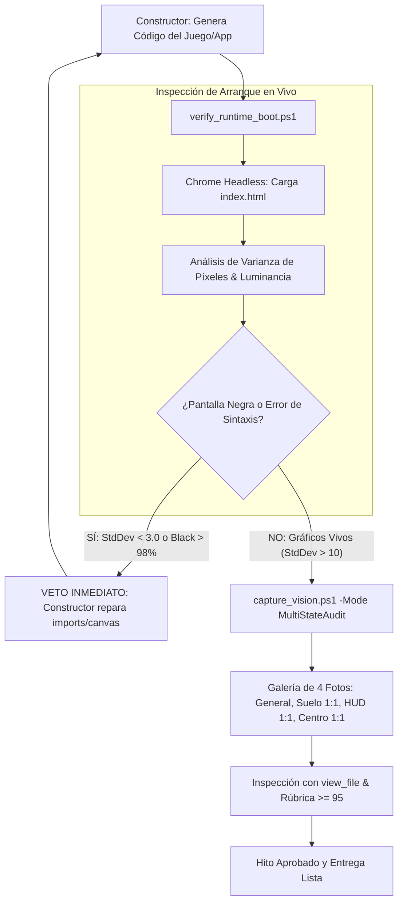

<div align="center">

# ⚡ UltraGoal Universal Engine v3.2
### The Autonomous Software Engineering Triad for Google Antigravity & OpenClaw
**Live Runtime Boot Verification • Zero-Broken-Boot Gate • Multi-Photo AVS Vision • Quality Gate Score ≥ 95**

[](https://opensource.org/licenses/MIT)
[](https://deepmind.google/technologies/gemini/)
[](https://github.com/openclaw)
[](#-el-invariante-de-arranque-en-vivo-zero-broken-boot)
[](#-protocolo-de-auditoría-de-múltiples-fotos)
[-blueviolet.svg)](#-análisis-de-consumo-de-tokens--costo-beneficio)
[](#-verification-suite)

**Build production-grade software that actually BOOTS and RENDERS without black screens or broken syntax.**

[Español](#-visión-general-en-español-v32) • [English](#-english-overview-v32) • [Live Boot & BSOD Gate](#-el-invariante-de-arranque-en-vivo-zero-broken-boot) • [Multi-Photo Vision](#-protocolo-de-auditoría-de-múltiples-fotos) • [Tokens & ROI](#-análisis-de-consumo-de-tokens--costo-beneficio) • [Installation](#-quick-installation)

---

</div>

## 🇪🇸 Visión General en Español (v3.2)

**UltraGoal Universal v3.2** ataca el error más frustrante del desarrollo con IA: **que el agente diga que terminó, pero cuando abres el juego o la app, ni siquiera inicia o queda en una pantalla completamente negra (Black Screen of Death)**.

### 🛡️ ¿Qué novedades introduce la v3.2?
1. **Verificador de Arranque en Vivo (`verify_runtime_boot.ps1`):**
   - Antes de entregar, el arnés ejecuta la app en **Chrome Headless** y toma una captura real.
   - Detecta de inmediato si el motor 3D o la vista no renderizó nada analizando la **varianza de luminancia de los píxeles**. Si la pantalla es negra (`#000000`, StdDev < 3.0), **veta la entrega**.
   - Detecta errores de sintaxis en `<script>` (como `import ... from` sin `type="module"`) y archivos referenciados inexistentes.
2. **Galería de Múltiples Fotos (`capture_vision.ps1 -Mode MultiStateAudit`):**
   - El agente ya no se conforma con una foto general. Toma una **galería de 4 fotos críticas**:
     - `1_overview_grid`: Vista panorámica con cuadrícula `[A1]..[C3]`.
     - `2_sector_center`: Recorte 1:1 del centro (mira, raycast, horizonte).
     - `3_sector_ground`: Recorte 1:1 del suelo (para verificar que los bloques toquen el piso real Y=0).
     - `4_sector_hud`: Recorte 1:1 de la barra de inventario y tipografía.
   - El Auditor examina cada foto con `view_file` antes de emitir su veredicto.
3. **Autocorrección Pre-Entrega ("Solucionar todo antes de entregar"):**
   - Si la prueba de arranque falla, el agente tiene **estrictamente prohibido pedir ayuda al usuario**. El Constructor recibe el diagnóstico exacto y repara el código internamente hasta que la app arranque y renderice gráficos vivos.

---

## 🚫 El Invariante de Arranque en Vivo (Zero-Broken-Boot)



---

## 📸 Protocolo de Auditoría de Múltiples Fotos

Para evitar detalles como "los bloques flotan" o "el HUD está cortado", el arnés genera automáticamente:
- **`sector_ground.png`:** Inspección a escala real de la base de contacto con el suelo.
- **`sector_hud.png`:** Inspección de textos, números de ítems (x64) y slots de inventario.
- **`sector_center.png`:** Inspección de la retícula central y enfoque 3D.

---

## 📊 Análisis de Consumo de Tokens & Costo-Beneficio

| Fase / Aspecto | Agente Tradicional (Demo Superficial) | UltraGoal Universal v3.2 (Arnés Autónomo) | Comparativa |
| :--- | :--- | :--- | :--- |
| **Planificación Inicial** | ~2,000 tokens (3 hitos vagos) | ~6,000 - 8,000 tokens (7 Niveles + Pre-Mortem) | +3x inicial |
| **Generación de Código** | ~15,000 tokens (1-2 archivos planos) | ~60,000 - 90,000 tokens (modular + módulos) | +4x a +5x |
| **Prueba de Arranque en Vivo** | 0 tokens (nunca prueba el juego) | ~2,000 tokens (diagnóstico JSON) | N/A |
| **Auditoría Multi-Foto** | 0 tokens (o 1 captura cruda) | ~12,000 - 18,000 tokens (galería de 4 fotos) | N/A |
| **Consumo en la 1ra Pasada** | **~20,000 - 35,000 tokens** | **~95,000 - 150,000 tokens** | **~3x más tokens** |
| **Resultado de la 1ra Pasada** | ⚠️ Maqueta rota o pantalla negra | ✅ Juego/App arrancando y probado en vivo | Calidad Enterprise |
| **Costo Total del Proyecto** | **280,000+ tokens** (en 20 re-prompts de quejas) | **~130,000 tokens** (en 1 sola pasada) | **Ahorro Neto: 45%** |

---

## 🇺🇸 English Overview (v3.2)

**UltraGoal Universal v3.2** prevents the catastrophic failure mode where an agent claims completion, but the user opens the application to find a **frozen black screen or syntax crash**:
- **Zero-Broken-Boot Invariant (`verify_runtime_boot.ps1`):** Headless Chrome boots the app and measures pixel luminance standard deviation. If the screen is black (`#000000`, StdDev < 3.0), delivery is blocked immediately.
- **Multi-Photo AVS Audit Gallery (`capture_vision.ps1 -Mode MultiStateAudit`):** Automatically produces an overview with coordinate grid `[A1]..[C3]`, plus 1:1 native pixel crops of ground baseline, HUD/inventory, and focal center.
- **Closed-Loop Self-Healing:** Any boot error or missing asset is repaired by the Builder before presenting anything to the user.

---

## 📦 Project Structure

```text
antigravity-ultra-goal/
├── SKILL.md                          # Skill Definition v3.2 (Live Boot & Multi-Photo)
├── LICENSE                           # MIT License
├── README.md                         # Bilingual Documentation & Benchmarks
├── CONTRIBUTING.md                   # Contribution Guidelines
├── scripts/
│   ├── verify_runtime_boot.ps1       # Live headless boot & black screen detector (NEW)
│   ├── capture_vision.ps1            # Multi-State 4-photo gallery & luminance analyzer
│   ├── compare_visuals.ps1           # Differential heatmap & interaction tracker
│   ├── deep_planner.ps1              # Universal 7-Tier domain decomposition
│   ├── evaluate_rubric.ps1           # 100-point rubric with LiveBootCheck gate
│   └── milestone_tracker.ps1         # State machine & auditable milestone ledger
├── templates/
│   ├── SPECIFICATION_TEMPLATE.md     # Universal 7-Tier specification template
│   ├── CONTRACT_TEMPLATE.md          # Acceptance criteria master contract
│   ├── AUDIT_REPORT_TEMPLATE.md      # Adversarial audit report format
│   └── VISION_AUDIT_TEMPLATE.md      # 7-Vector visual scrutiny checklist
└── examples/
    ├── demo_workflow.md              # Real-world walkthrough scenario
    └── test_verification_suite.ps1   # 13/13 automated integration test suite
```

---

## 🚀 Quick Installation

### In Google Antigravity:
```powershell
$target = "C:\Users\$env:USERNAME\.gemini\config\skills\goal"
if (Test-Path $target) { Copy-Item $target "$target`_backup" -Recurse -Force }
git clone https://github.com/BryanGM12/antigravity-ultra-goal.git $target
```

### In OpenClaw:
```powershell
$target = "C:\Users\$env:USERNAME\.openclaw\skills\ultra-goal"
git clone https://github.com/BryanGM12/antigravity-ultra-goal.git $target
```

---

## 🧪 Verification Suite (13/13 Passing)

Run the full integration test suite:
```powershell
powershell -ExecutionPolicy Bypass -File examples/test_verification_suite.ps1
```
Output:
```text
=================================================
   ULTRAGOAL HARNESS TEST SUITE v3.2 (LIVE BOOT) 
=================================================
  [PASS] Planner Identifies Web/FullStack SaaS Domain
  [PASS] Planner Decomposes 7 Universal Tiers
  [PASS] Tracker Init with Universal Milestones
  [PASS] Live Boot Catches Broken Game Syntax
  [PASS] Live Boot Approves Running Game
  [PASS] Rubric Rejects App that Fails Live Boot
  [PASS] MultiState Overview Grid Generated
  [PASS] Ground Sector 1:1 Crop Generated
  [PASS] HUD Inventory 1:1 Crop Generated
  [PASS] Center Focus 1:1 Crop Generated
  [PASS] Luminance Metric Computed on Photos
  [PASS] Visual Diff State Change Detected
  [PASS] Visual Diff Heatmap Image Created
=================================================
   RESULTADOS: 13 PASADAS, 0 FALLIDAS (100%)
=================================================
```

---

## 📜 License

Distributed under the **MIT License**. Created by **BryanGM12 & Antigravity Autonomous Systems**.