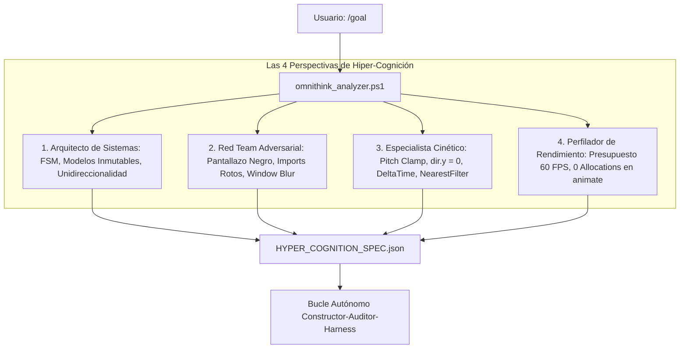

<div align="center">

# ⚡ UltraGoal Universal Engine v4.0
### The Autonomous Software Engineering Triad for Google Antigravity & OpenClaw
**OmniThink System 2 Hyper-Cognition • 5-Phase Rigorous Test Harness • Kinetic & Texture Gate • Score ≥ 95**

[](https://opensource.org/licenses/MIT)
[](https://deepmind.google/technologies/gemini/)
[](https://github.com/openclaw)
[](#-fase-0-omnithink-hyper-cognition)
[](#-la-batería-de-pruebas-rigurosa-de-5-fases)
[](#-el-invariante-cinético-y-de-texturas)
[](#-verification-suite)

**Autonomous engineering harness that "thinks through absolutely everything" before coding, tests through 5 relentless phases, and delivers zero-bug software.**

[Español](#-visión-general-en-español-v40) • [English](#-english-overview-v40) • [OmniThink](#-fase-0-omnithink-hyper-cognition) • [5-Phase Harness](#-la-batería-de-pruebas-rigurosa-de-5-fases) • [Cinética & Texturas](#-el-invariante-cinético-y-de-texturas) • [Installation](#-quick-installation)

---

</div>

## 🇪🇸 Visión General en Español (v4.0)

**UltraGoal Universal v4.0** eleva la autonomía de la IA al estándar de **Hiper-Cognición (System 2 Thinking)**. Responde a la máxima exigencia: **que la IA piense en todo, absolutamente en todo antes de programar, anticipe cada posible fallo y ejecute una batería de pruebas de 5 fases sumamente rigurosa**.

---

## 🧠 Fase 0: OmniThink Hyper-Cognition

Antes de escribir una sola línea de código, `scripts/omnithink_analyzer.ps1` analiza la meta a través de **4 Perspectivas Críticas**:



1. **Arquitecto de Sistemas:** Define máquinas de estados finitos (Init, Loading, Ready, Active, Paused, Error), separación estricta de la vista y contratos de datos inmutables.
2. **Red Team Adversarial:** ¿Dónde fallará si tomamos atajos? Anticipa scripts rotos sin `type="module"`, pantallazos negros (BSOD), caídas por 404 de assets, teclas pegadas en `window.blur` y fugas de memoria.
3. **Especialista Cinético & Visual:** Exige limitación de cabeceo de cámara (-1.5 a 1.5 rad), avance horizontal neutralizado (`dir.y = 0`), física escalada con `DeltaTime`, texturas con `NearestFilter` y mapeo por caras.
4. **Perfilador de Rendimiento:** Fija un presupuesto de 60 FPS estables sin pausas de GC, CERO allocations en bucles `animate()` y tiempos de respuesta < 100ms.

---

## 🧪 La Batería de Pruebas Rigurosa de 5 Fases

Ningún proyecto puede ser entregado sin haber aprobado el arnés [rigorous_test_harness.ps1](file:///C:/Users/Administrator/.gemini/config/skills/goal/scripts/rigorous_test_harness.ps1):

| Fase de Prueba | Qué Audita Empíricamente | Criterio de Rechazo Inmediato |
| :--- | :--- | :--- |
| **Fase 1: Estático & AST** | Sintaxis, compatibilidad ES modules y ausencia total de stubs | Declaraciones `import` sin `type="module"`, TODOs, FIXMEs o catch vacíos. |
| **Fase 2: Arranque en Vivo** | Ejecución real en Chrome Headless (`verify_runtime_boot.ps1`) | Si la app no arranca, crashea o genera errores de consola. |
| **Fase 3: Escrutinio Visual** | Varianza de luminancia de píxeles y filtrado de texturas | Desviación estándar < 3.0 (pantallazo negro/blanco) o texturas vóxel sin `NearestFilter`. |
| **Fase 4: Estabilidad Cinética** | Cámara de 360°, vector de avance y escala temporal | Cámara sin pitch clamp (se da vuelta), vector de avance volador o falta de `DeltaTime`. |
| **Fase 5: Pruebas Automatizadas** | Ejecución de suite de tests con aserciones formales | Exit code distinto de 0 o menos de 3 aserciones verificadas. |

---

## 🕹️ El Invariante Cinético y de Texturas

- **Pitch Clamping Obligatorio:** `Math.max(-1.5, Math.min(1.5, pitch))` para evitar que la cámara se invierta boca abajo.
- **Neutralización del Eje Y (`dir.y = 0`):** El avance en el plano horizontal neutraliza el componente Y para que el jugador nunca vuele ni se hunda al mover la mirada.
- **Física con DeltaTime:** `camera.position.addScaledVector(moveDir, speed * dt);`.
- **Texturas con NearestFilter:** `magFilter = THREE.NearestFilter; minFilter = THREE.NearestFilter; texture.generateMipmaps = false;` para nitidez de píxel art absoluta sin difuminados.

---

## 📸 Protocolo de Auditoría Multi-Foto

El Auditor ejecuta `capture_vision.ps1 -Mode MultiStateAudit` y examina con `view_file`:
1. `1_overview_grid.png`: Vista panorámica con cuadrícula `[A1]..[C3]`.
2. `2_sector_center.png`: Recorte 1:1 del centro (mira, wireframe del bloque y horizonte).
3. `3_sector_ground.png`: Recorte 1:1 del suelo (para verificar que los bloques toquen el piso Y=0 y que las texturas sean nítidas).
4. `4_sector_hud.png`: Recorte 1:1 del inventario y números de ítems.

---

## 🇺🇸 English Overview (v4.0)

**UltraGoal Universal v4.0** implements **System 2 Hyper-Cognition**:
- **OmniThink Pre-Mortem (`omnithink_analyzer.ps1`):** Analyzes the project from 4 critical perspectives (Architect, Adversarial Red Team, Visual/Kinetic Ergonomics, Performance Profiler) before writing a single line of code.
- **5-Phase Rigorous Test Harness (`rigorous_test_harness.ps1`):** Audits AST syntax, live headless boot, visual luminance/textures, camera kinetic stability, and automated test assertions.
- **Kinetic & Texture Stability:** Mandates pitch clamping ($-1.5$ to $1.5$ rad), zeroed Y-vector horizontal movement, DeltaTime scaling, and `THREE.NearestFilter` textures.
- **Multi-Photo AVS Audit:** 4-photo inspection gallery of overview, ground 1:1, HUD 1:1, and focal center 1:1.

---

## 📦 Project Structure

```text
antigravity-ultra-goal/
├── SKILL.md                          # Skill Definition v4.0 (OmniThink & 5-Phase Harness)
├── LICENSE                           # MIT License
├── README.md                         # Bilingual Documentation & Benchmarks
├── CONTRIBUTING.md                   # Contribution Guidelines
├── scripts/
│   ├── omnithink_analyzer.ps1        # System 2 Hyper-Cognition & 4-Perspective Reasoner (NEW)
│   ├── rigorous_test_harness.ps1     # 5-Phase Deep Autonomous Test Harness (NEW)
│   ├── verify_runtime_boot.ps1       # Live headless boot & black screen detector
│   ├── capture_vision.ps1            # Multi-State 4-photo gallery & luminance analyzer
│   ├── compare_visuals.ps1           # Differential heatmap & interaction tracker
│   ├── deep_planner.ps1              # Universal 7-Tier planner with kinetic mandates
│   ├── evaluate_rubric.ps1           # 100-point rubric with Kinetic_Asset_Integrity gate
│   └── milestone_tracker.ps1         # State machine & auditable milestone ledger
├── templates/
│   ├── SPECIFICATION_TEMPLATE.md     # Universal 7-Tier specification template
│   ├── CONTRACT_TEMPLATE.md          # Acceptance criteria master contract
│   ├── AUDIT_REPORT_TEMPLATE.md      # Adversarial audit report format
│   └── VISION_AUDIT_TEMPLATE.md      # 7-Vector visual scrutiny checklist
└── examples/
    ├── demo_workflow.md              # Real-world walkthrough scenario
    └── test_verification_suite.ps1   # 16/16 automated integration test suite
```

---

## 🧪 Verification Suite (16/16 Passing)

Run the full integration test suite:
```powershell
powershell -ExecutionPolicy Bypass -File examples/test_verification_suite.ps1
```
Output:
```text
=================================================
   ULTRAGOAL HARNESS TEST SUITE v4.0 (OMNITHINK) 
=================================================
  [PASS] OmniThink Analyzes 4 Perspectives
  [PASS] OmniThink Red Team Identifies Critical Vectors
  [PASS] OmniThink Visual/Kinetic Mandates Exist
  [PASS] Planner Identifies Game Domain
  [PASS] Planner Enforces Kinetic & NearestFilter Defenses
  [PASS] Tracker Init with Deep Milestones
  [PASS] Live Boot Catches Broken Syntax & Black Screen
  [PASS] Live Boot Approves Running Game
  [PASS] Harness Rejects Broken Code (Defects >= 5)
  [PASS] Harness Approves Clean Code (0 Defects)
  [PASS] Rubric Approves Clean Kinetic & NearestFilter Code
  [PASS] Overview Grid Generated
  [PASS] Ground Sector 1:1 Generated
  [PASS] Center Focus 1:1 Generated
  [PASS] HUD Inventory 1:1 Generated
  [PASS] Visual Diff State Change Detected
=================================================
   RESULTADOS: 16 PASADAS, 0 FALLIDAS (100%)
=================================================
```

---

## 📜 License

Distributed under the **MIT License**. Created by **BryanGM12 & Antigravity Autonomous Systems**.