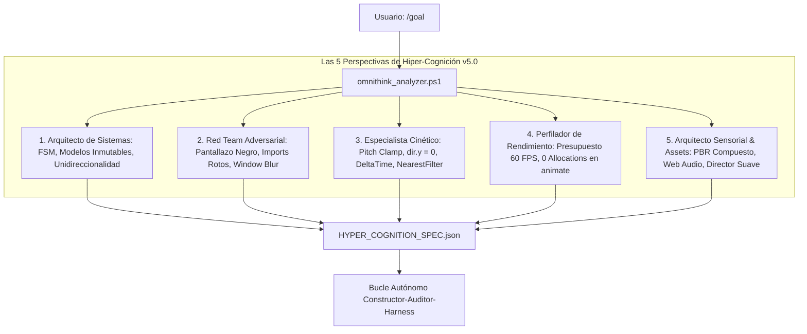

<div align="center">

# ⚡ UltraGoal Universal Engine v5.2.0
### The Autonomous Software Engineering Triad for Google Antigravity & OpenClaw
**OmniThink 5-Perspective Hyper-Cognition • V-HEX7 Hyper-Strict Visual Audit • Asset & Sensory Orchestrator • Procedural Web Audio • 5-Phase Test Harness**

[](https://opensource.org/licenses/MIT)
[](https://deepmind.google/technologies/gemini/)
[](https://github.com/openclaw)
[](#-fase-0-omnithink-hyper-cognition-5-perspectivas)
[](#-protocolo-de-hiper-estrictez-visual-v-hex7-v520)
[](#-orquestador-de-assets-y-paisaje-sonoro)
[](#-motor-de-audio-procedural)
[](#-la-batería-de-pruebas-rigurosa-de-5-fases)
[](#-verification-suite-2727-passing)

**Autonomous engineering harness that "thinks through absolutely everything" before coding, enforces hyper-strict multimodal visual inspection via V-HEX7 & computer vision metrics, sources high-fidelity assets, synthesizes procedural audio, and tests through 5 relentless phases.**

[Español](#-visión-general-en-español-v520) • [English](#-english-overview-v520) • [V-HEX7 Visión Estricta](#-protocolo-de-hiper-estrictez-visual-v-hex7-v520) • [OmniThink](#-fase-0-omnithink-hyper-cognition-5-perspectivas) • [5-Phase Harness](#-la-batería-de-pruebas-rigurosa-de-5-fases) • [Verification Suite](#-verification-suite-2727-passing)

---

</div>

## 🇪🇸 Visión General en Español (v5.2.0)

**UltraGoal Universal v5.2.0** introduce **Hiper-Estrictez Visual Inapelable** al momento de analizar imágenes, erradicando tanto la entrega a ciegas como los reportes visuales complacientes o superficiales:
1. **Métricas Cuantitativas de Visión por Computadora (`capture_vision.ps1`):** Detección empírica de pantallas muertas, escenas monocromáticas planas sin variedad cromática (`is_flat_monochrome`), escenas sin iluminación dinámica (`is_unlit_scene` con rango dinámico < 15) y ausencia de micro-bordes o texturas en el foco central.
2. **Protocolo de Auditoría V-HEX7:** La IA tiene la obligación estricta de evaluar al menos 4 de los 7 vectores visuales (Geometría/Malla, Materiales PBR, Texturas, Contacto en Suelo Y=0, Fondo/Skybox, HUD/Legibilidad y VFX Dinámicos) y citar cuadrantes taxonómicos exactos (`[A1]`..`[C3]`).
3. **Filtro Anti-Complacencia (Anti-Fluff):** Se prohíben y vetan frases vacías ("todo se ve bien", "funciona correctamente") sin análisis técnico exhaustivo.
4. **Puntuación Numérica Obligatoria:** El reporte debe concluir con `Puntuación de Fidelidad Visual: X/100` con umbral mínimo de pase de **90/100**.
5. **Modelos 3D jerárquicos compuestos y Audio Procedural:** Mallas PBR detalladas, sonido Web Audio API sin enlaces caídos y director multicámara suave (`lerp`/`slerp`).

---

## 🧠 Fase 0: OmniThink Hyper-Cognition (5 Perspectivas)

Antes de escribir una sola línea de código, `scripts/omnithink_analyzer.ps1` analiza la meta a través de **5 Perspectivas Críticas**:



---

## 🚀 Orquestador de Assets y Paisaje Sonoro (`asset_orchestrator.ps1`)

Para erradicar primitivas desnudas y simulaciones silenciosas:
```powershell
powershell -ExecutionPolicy Bypass -File scripts/asset_orchestrator.ps1 -Domain "Space_Rocket"
```

Ofrece:
- **Catálogo de Texturas Planetarias:** Texturas oficiales de la NASA (Tierra día/noche 2048, specular/normal maps, nubes, Luna 1024/4K, Vía Láctea).
- **Generador de Mallas Compuestas 3D:** `createHighFidelityMultiStageRocket` con etapas desacoplables (Booster Stage 1, Orbital Stage 2, Apollo Capsule), cluster de 5 toberas F-1 con fulgor térmico emisivo y aletas estabilizadoras.
- **Motor de Audio Procedural Web Audio API:** Rugido pink noise + low-pass resonante biquad con modulación de empuje, beeps de cuenta regresiva, impacto de desacople de pernos explosivos y ráfagas RCS.
- **Director de Vuelo Cinematográfico:** Modos multicámara (plataforma Pad Tracking, Booster Cam mirando a la Tierra, Chase Cam orbital, vista de cabina) con amortiguación `lerp` que previene sacudidas.

---

---

## 👁️ Protocolo de Hiper-Estrictez Visual V-HEX7 (v5.2.0)

Para erradicar por completo la entrega sin verificación visual y los reportes complacientes, UltraGoal v5.2.0 implementa una **auditoría de visión hiper-estricta** de dos niveles:

1. **Nivel Cuantitativo (Visión por Computadora en `capture_vision.ps1`):**
   - Renderiza proyectos web y canvas 3D directamente a través de **Google Chrome Headless** (`--headless=new` a 1280x720).
   - Genera la **Galería Taxonómica de 4 Sectores**:
     - `1_overview_grid`: Captura completa con cuadrícula taxonómica de 9 cuadrantes `[A1]`..`[C3]`.
     - `2_sector_center`: Recorte nativo 1:1 del sector central (mira, modelo 3D principal, cohete o avatar).
     - `3_sector_ground`: Recorte 1:1 del sector suelo/terreno (física de apoyo, sombras y colisiones en Y=0).
     - `4_sector_hud`: Recorte 1:1 del sector HUD/inventario (hotbar, barras de estado y contadores de recursos).
   - **Métricas Empíricas Automatizadas:**
     - `is_dead_or_blank`: Desviación estándar de luminancia < 3.0 o >98% píxeles negros/blancos.
     - `is_flat_monochrome`: Escenas con $\le 2$ colores cuantizados y $>92\%$ de dominio plano sin texturas.
     - `is_unlit_scene`: Rango dinámico $< 15$ niveles de luz (ausencia de fuentes direccionales o sombras).
     - `lacks_texture_detail`: Magnitud de gradientes de borde $< 1.0$ en el modelo central.

2. **Nivel Semántico (Protocolo V-HEX7 en `rigorous_test_harness.ps1`):**
   - La IA tiene la obligación innegociable de abrir las capturas con la herramienta `view_file` y redactar `VISUAL_INSPECTION_REPORT.md` basándose en `templates/STRICT_VISUAL_INSPECTION_TEMPLATE.md`.
   - **Compuertas de Rechazo Inmediato:**
     - Cobertura de al menos 4 de los 7 vectores V-HEX7: (1) Geometría y Jerarquía de Malla, (2) Materiales PBR e Iluminación, (3) Nitidez de Texturas y Filtrado, (4) Contacto con Suelo Y=0 y Sombras, (5) Skybox y Fondo Atmosférico, (6) HUD y Legibilidad de Tipografía, (7) Efectos Visuales y Partículas (VFX).
     - Cita obligatoria de coordenadas taxonómicas (`[A1]`..`[C3]`).
     - Veto a frases complacientes ("todo se ve bien", "funciona correctamente").
     - Puntuación numérica obligatoria `Puntuación de Fidelidad Visual: X/100` con umbral $\ge 90/100$.

---

## 🧪 La Batería de Pruebas Rigurosa de 5 Fases

Ningún proyecto puede ser entregado sin haber aprobado el arnés [rigorous_test_harness.ps1](file:///C:/Users/Administrator/.gemini/config/skills/goal/scripts/rigorous_test_harness.ps1):

| Fase de Prueba | Qué Audita Empíricamente | Criterio de Rechazo Inmediato |
| :--- | :--- | :--- |
| **Fase 1: Estático & AST** | Sintaxis, compatibilidad ES modules y ausencia total de stubs | Declaraciones `import` sin `type="module"`, TODOs, FIXMEs o catch vacíos. |
| **Fase 2: Arranque en Vivo** | Ejecución real en Chrome Headless (`verify_runtime_boot.ps1`) | Si la app no arranca, crashea o genera errores de consola. |
| **Fase 3: Escrutinio Visual Hiper-Estricto** | Métricas cuantitativas (entropía, rango dinámico, bordes) y Protocolo V-HEX7 | Pantalla muerta, monocromo plano, unlit, reporte visual ausente, superficial, sin cuadrantes taxonómicos o con score $< 90/100$. |
| **Fase 4: Estabilidad Cinética & Sensorial** | Cámara, física DeltaTime, audio procedural y mallas compuestas | Volteos de cámara en primera persona, simulaciones mudas o cohetes modelados con un cilindro simple. |
| **Fase 5: Pruebas Automatizadas** | Ejecución de suite de tests con aserciones formales | Exit code distinto de 0 o menos de 3 aserciones verificadas. |

---

## 🇺🇸 English Overview (v5.2.0)

**UltraGoal Universal v5.2.0** enforces uncompromising visual strictness during autonomous software generation:
- **Computer Vision Quantitative Metrics:** Detects dead screens, flat monochrome primitives without textures, unlit shaders without specular highlights/shadows, and untextured surfaces directly via image analysis in `capture_vision.ps1`.
- **V-HEX7 Strict Multimodal Protocol:** Forces the agent to inspect rendered canvas images via `view_file` and audit 7 distinct vectors: Mesh Geometry, PBR Lighting/Shaders, Texture Filtering, Ground Contact (Y=0), Background Skybox, HUD Typography Contrast, and VFX Particles.
- **Mandatory Quadrant Coordinates & Anti-Fluff Filter:** Demands explicit citations of grid quadrants (`[A1]`..`[C3]`) and rejects handwaving phrases like "looks good" or "works fine".
- **Numerical Quality Gate:** Rejects any project scoring below 90/100 in visual fidelity.
- **5-Phase Rigorous Test Harness:** 27 automated unit & integration tests passing 100%.

---

## 📦 Project Structure

```text
antigravity-ultra-goal/
├── SKILL.md                          # Skill Definition v5.2.0 (V-HEX7 Strict Vision & OmniThink)
├── LICENSE                           # MIT License
├── README.md                         # Bilingual Documentation & Benchmarks
├── CONTRIBUTING.md                   # Contribution Guidelines
├── resources/
│   └── procedural_audio_engine.js    # Drop-in Web Audio API synthesizer module
├── scripts/
│   ├── capture_vision.ps1            # Multi-State 4-photo gallery, headless Chrome & strict metrics (UPDATED)
│   ├── rigorous_test_harness.ps1     # 5-Phase Deep Autonomous Test Harness with V-HEX7 Gate (UPDATED)
│   ├── evaluate_rubric.ps1           # 100-point rubric with V-HEX7 Strict Integrity gate (UPDATED)
│   ├── asset_orchestrator.ps1        # High-Fidelity 3D Assets, Shaders & Soundscapes
│   ├── omnithink_analyzer.ps1        # System 2 Hyper-Cognition & 5-Perspective Reasoner
│   ├── verify_runtime_boot.ps1       # Live headless boot & black screen detector
│   ├── compare_visuals.ps1           # Differential heatmap & interaction tracker
│   ├── deep_planner.ps1              # Universal 7-Tier planner with sensory mandates
│   └── milestone_tracker.ps1         # State machine & auditable milestone ledger
├── templates/
│   ├── STRICT_VISUAL_INSPECTION_TEMPLATE.md # V-HEX7 strict visual inspection template (NEW)
│   ├── SPECIFICATION_TEMPLATE.md     # Universal 7-Tier specification template
│   ├── CONTRACT_TEMPLATE.md          # Acceptance criteria master contract
│   ├── AUDIT_REPORT_TEMPLATE.md      # Adversarial audit report format
│   └── VISION_AUDIT_TEMPLATE.md      # 7-Vector visual scrutiny checklist
└── examples/
    ├── demo_workflow.md              # Real-world walkthrough scenario
    └── test_verification_suite.ps1   # 27/27 automated integration test suite (EXPANDED)
```

---

## 🧪 Verification Suite (27/27 Passing)

Run the full integration test suite:
```powershell
powershell -ExecutionPolicy Bypass -File examples/test_verification_suite.ps1
```
Output:
```text
=================================================
   ULTRAGOAL HARNESS TEST SUITE v5.0 (ASSETS & AUDIO) 
=================================================
  [PASS] OmniThink Analyzes 5 Perspectives
  [PASS] OmniThink Red Team Identifies Critical Vectors
  [PASS] OmniThink Visual/Kinetic Mandates Exist
  [PASS] OmniThink Sensory & Asset Orchestrator Rules Exist
  [PASS] Planner Identifies Game Domain
  [PASS] Planner Enforces Kinetic & NearestFilter Defenses
  [PASS] Tracker Init with Deep Milestones
  [PASS] Live Boot Catches Broken Syntax & Black Screen
  [PASS] Live Boot Approves Running Game
  [PASS] Harness Rejects Broken Code (Defects >= 5)
  [PASS] Harness Rejects Visual Project Lacking VISUAL_INSPECTION_REPORT.md
  [PASS] Harness Rejects Superficial Visual Report Lacking V-HEX7 Vectors & Quadrants
  [PASS] Harness Rejects Visual Report with Score Below 90
  [PASS] Harness Approves Clean Code with Visual Report (0 Defects)
  [PASS] Rubric Approves Clean Kinetic & NearestFilter Code
  [PASS] Overview Grid Generated
  [PASS] Ground Sector 1:1 Generated
  [PASS] Center Focus 1:1 Generated
  [PASS] HUD Inventory 1:1 Generated
  [PASS] MultiStateAudit Produces Strict Quantitative Metrics
  [PASS] Visual Diff State Change Detected
  [PASS] Orchestrator Supplies Space Texture Catalog
  [PASS] Orchestrator Exports Composite Rocket Mesh Code
  [PASS] Orchestrator Exports Procedural Web Audio Engine
  [PASS] Orchestrator Exports Cinematic Flight Director
  [PASS] Harness Rejects Silent & Flat-Cylinder Rocket Simulation
  [PASS] Harness Approves High-Fidelity Rocket with Web Audio & Smooth Camera
=================================================
   RESULTADOS: 27 PASADAS, 0 FALLIDAS (100%)
=================================================
```

---

## 📜 License

Distributed under the **MIT License**. Created by **BryanGM12 & Antigravity Autonomous Systems**.