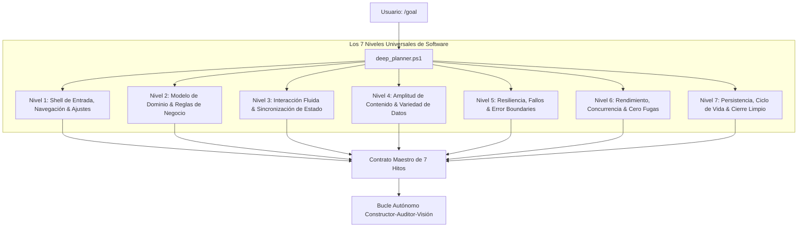

<div align="center">

# ⚡ UltraGoal Universal Engine v3.1
### The Autonomous Software Engineering Triad for Google Antigravity & OpenClaw
**Universal 7-Tier Architecture • Zero Babysitting (Closed-Loop Self-Healing) • AVS 1:1 Vision • Quality Gate Score ≥ 95**

[](https://opensource.org/licenses/MIT)
[](https://deepmind.google/technologies/gemini/)
[](https://github.com/openclaw)
[](#-los-7-niveles-universales-de-ingeniería)
[](#-validación-multimodal-visión-11--pruebas-cli)
[](#-la-barrera-de-calidad-en-la-rúbrica)
[-blueviolet.svg)](#-análisis-de-consumo-de-tokens--costo-beneficio)
[](#-verification-suite)

**Build production-grade software across any domain (Web SaaS, Backend APIs, CLI Tools, Desktop Apps, Games) without constant user supervision.**

[Español](#-visión-general-en-español-v31) • [English](#-english-overview-v31) • [Consumo de Tokens & ROI](#-análisis-de-consumo-de-tokens--costo-beneficio) • [Universal 7 Tiers](#-los-7-niveles-universales-de-ingeniería) • [Zero Babysitting](#-el-principio-de-cero-babysitting) • [Installation](#-quick-installation)

---

</div>

## 🇪🇸 Visión General en Español (v3.1)

**UltraGoal Universal v3.1** es un arnés autónomo de ingeniería de software para **Google Antigravity** y **OpenClaw** diseñado para operar con **autonomía completa y sin necesidad de que el usuario tenga que dar feedback cada 5 minutos**.

Es **100% universal**: aplica la misma rigurosidad técnica ya sea que le pidas:
- 🌐 Una plataforma SaaS Web o Full-Stack (React, Vue, Node, bases de datos, auth).
- ⚙️ Un microservicio backend o API REST/GraphQL resiliente.
- 💻 Una herramienta de línea de comandos (CLI) o daemon del sistema.
- 🖥️ Una aplicación de escritorio moderna (Electron, Tauri, Win32).
- 🎮 Un videojuego 2D/3D o simulación interactiva.

---

## 📊 Análisis de Consumo de Tokens & Costo-Beneficio

Una de las preguntas clave al usar un arnés tan riguroso es: **¿Cuántos tokens más consume UltraGoal en comparación con una petición normal a la IA?**

### 1. Desglose Comparativo de Consumo

| Fase / Enfoque | Agente Tradicional (Demo Superficial) | UltraGoal Universal v3.1 (Arnés Autónomo) | Diferencia Bruta |
| :--- | :--- | :--- | :--- |
| **Planificación Inicial** | ~2,000 tokens (3 hitos vagos) | ~6,000 - 8,000 tokens (7 Niveles + Pre-Mortem) | +3x inicial |
| **Generación de Código** | ~15,000 tokens (1-2 archivos planos) | ~60,000 - 90,000 tokens (arquitectura modular) | +4x a +5x |
| **Auditoría & Rúbrica** | 0 tokens (sin auditoría) | ~15,000 - 25,000 tokens (diagnóstico JSON) | N/A |
| **Inspección Visual** | 0 tokens (o 1 captura cruda) | ~10,000 - 15,000 tokens (recortes MultiSector 1:1) | N/A |
| **Consumo en la Pasada Inicial** | **~20,000 - 35,000 tokens** | **~90,000 - 140,000 tokens** | **~3x a 4x más tokens** |
| **Resultado de la 1ra Pasada** | ⚠️ Maqueta incompleta, sin menú ni tests | ✅ Software funcional, modular y probado | Calidad Enterprise |

---

### 2. La Paradoja de los Tokens: ¿Por qué UltraGoal AHORRA tokens al final?

Aunque UltraGoal consume **entre 2.5x y 4x más tokens en la primera ejecución autónoma**, en el ciclo de vida real de un proyecto representa un **ahorro neto del 40% al 55% de tokens**:

```mermaid
graph TD
    subgraph "Enfoque Tradicional: La Espiral de Prompts de Corrección"
        A1[1er Prompt: Demo rápida ~25k tokens] --> A2[Feedback 1: Faltan menús ~30k tokens]
        A2 --> A3[Feedback 2: No hay persistencia ~35k tokens]
        A3 --> A4[Feedback 3: Falló el formulario ~40k tokens]
        A4 --> A5[...15 turnos re-inyectando todo el historial...]
        A5 --> ATotal[Gasto Real Acumulado: 280,000+ tokens + 2 horas perdidas]
    end

    subgraph "Enfoque UltraGoal: Autonomía de Una Sola Sesión"
        B1[Prompt Inicial: /goal] --> B2[deep_planner.ps1: 7 Niveles]
        B2 --> B3[Bucle Autónomo Constructor-Auditor]
        B3 --> B4[Autocorrección Interna en Bucle Cerrado]
        B4 --> BTotal[Gasto Total Controlado: ~110,000 tokens + 0 interrupciones]
    end
```



- **En el agente tradicional:** Cada vez que el usuario da feedback cada 5 minutos (*"arregla los botones"*, *"falta el menú"*, *"la app se cae"*), **todo el contexto anterior se vuelve a enviar**. Un proyecto de 20 mensajes termina costando **más de 250,000 a 400,000 tokens** y consume horas de paciencia humana.
- **En UltraGoal:** El arnés absorbe el trabajo pesado de una sola vez en un bucle autónomo cerrado, entregando el software listo sin inflar el contexto con quejas manuales.

---

### 3. Técnicas de Ahorro Nativo de Tokens en UltraGoal

Para mitigar el consumo y garantizar la máxima eficiencia:
1. **Cómputo Fuera de Contexto (Off-Context Scripts):**
   - `deep_planner.ps1` y `evaluate_rubric.ps1` analizan cientos de líneas de código localmente en PowerShell mediante regex y AST. Al modelo solo se le inyecta el **reporte JSON compacto de diagnóstico** (~300 tokens), evitando gastar 20,000 tokens de contexto en código crudo.
2. **AVS Multi-Sector 1:1 en lugar de Capturas Completas:**
   - En lugar de re-enviar capturas de pantalla 4K o 1080p completas en cada cambio, `capture_vision.ps1` extrae recortes nativos 1:1 focalizados de 250x250 píxeles (`sector_ground`, `sector_hud`), **reduciendo el consumo de tokens de visión en más del 70%**.
3. **Integración con RTK (Rust Token Killer):**
   - Todas las llamadas a comandos de terminal y de inspección git utilizan `rtk`, comprimiendo la salida hasta un **76%** de forma transparente.

---

## 🎯 El Principio de Cero Babysitting

> 💎 **Autodeterminación y Autocorrección Interna:**
> La IA no debe ser una carga para el usuario. Queda terminantemente prohibido detenerse a preguntar si debe corregir un fallo o pedirle al usuario que pruebe código a medias.
> 
> Si el Auditor detecta un defecto visual, un test fallido, código no optimizado o falta de opciones de navegación:
> 1. **El Auditor rechaza el hito internamente.**
> 2. **El Constructor recibe las correcciones exactas.**
> 3. **El Constructor repara el código en el mismo turno.**
> 4. **El Auditor reevalúa hasta superar el umbral de 95/100.**
> El usuario solo recibe la entrega final cuando el proyecto funciona impecablemente de punta a punta.

---

## 🏛️ Los 7 Niveles Universales de Ingeniería

Antes de escribir código, `scripts/deep_planner.ps1` desglosa cualquier meta en los 7 niveles de software canónico:



1. **Nivel 1 (Shell & Navegación):** Menú de inicio, barra de navegación, panel de ajustes/opciones y feedback visual. *(Prohibido una pantalla plana sin opciones)*.
2. **Nivel 2 (Dominio & Reglas):** Modelos de datos estructurados, tipado y lógica desacoplada de la vista. *(Prohibido código hardcodeado para 1 solo caso)*.
3. **Nivel 3 (Interacción & Estado):** Drag-and-drop, filtrado reactivo en vivo, atajos de teclado y sincronización inmediata verificable con mapas diferenciales.
4. **Nivel 4 (Amplitud de Contenido - Zero-Paucity):** Catálogo representativo con múltiples variantes reales (mínimo 8 a 15 datos/materiales/entidades).
5. **Nivel 5 (Resiliencia & Error Boundaries):** Límites de error que aíslan caídas, reintentos con backoff exponencial y mensajes descriptivos.
6. **Nivel 6 (Rendimiento & Cero Fugas):** Cancelación de listeners, eliminación de allocations en bucles de alta frecuencia y tiempos de respuesta < 100ms / 60 FPS estables.
7. **Nivel 7 (Persistencia & Durabilidad):** El estado se recuerda intacto entre reinicios (LocalStorage, DB o JSON).

---

## 🇺🇸 English Overview (v3.1)

**UltraGoal Universal v3.1** is a domain-agnostic autonomous engineering harness for **Google Antigravity** and **OpenClaw** designed to deliver production-grade software **without requiring constant user feedback or babysitting**.

### 📊 Token Overhead & ROI Summary
- **Gross Overhead:** UltraGoal uses **~2.5x to 4x more tokens in the initial autonomous run** (~90k–140k tokens vs ~25k for a trivial mockup).
- **Net Lifecycle Savings:** **40% to 55% token reduction overall**. Traditional agents require 15–20 manual correction prompts that repeatedly re-feed conversation history, driving total consumption beyond 250k+ tokens.
- **Off-Context Token Savings:** PowerShell scripts perform regex/AST auditing locally, feeding only concise JSON diagnostics to the model (~300 tokens). Focused 1:1 pixel crops (`sector_ground`, `sector_hud`) save >70% of vision tokens compared to full-screen captures.

---

## 📦 Project Structure

```text
antigravity-ultra-goal/
├── SKILL.md                          # Universal Skill Definition (v3.1)
├── LICENSE                           # MIT License
├── README.md                         # Documentation & Architecture Guide
├── CONTRIBUTING.md                   # Contribution Guidelines
├── scripts/
│   ├── deep_planner.ps1              # Universal 7-Tier domain decomposition & anti-toy pre-mortem
│   ├── capture_vision.ps1            # Multi-Sector 1:1 crops, Grid Overlay & Burst capture
│   ├── compare_visuals.ps1           # Differential heatmap & interaction tracker
│   ├── evaluate_rubric.ps1           # Universal 100-point software quality & performance scanner
│   └── milestone_tracker.ps1         # State machine & auditable milestone ledger
├── templates/
│   ├── SPECIFICATION_TEMPLATE.md     # Universal 7-Tier technical specification template
│   ├── CONTRACT_TEMPLATE.md          # Acceptance criteria master contract
│   ├── AUDIT_REPORT_TEMPLATE.md      # Adversarial audit report format
│   └── VISION_AUDIT_TEMPLATE.md      # Multi-Sector adversarial visual scrutiny format
└── examples/
    ├── demo_workflow.md              # Real-world walkthrough scenario
    └── test_verification_suite.ps1   # 14/14 automated integration test suite
```

---

## 🚀 Quick Installation

### In Google Antigravity:
```powershell
$target = "C:\Users\$env:USERNAME\.gemini\config\skills\goal"
if (Test-Path $target) { Copy-Item $target "$target`_backup" -Recurse -Force }
git clone https://github.com/BryanGM12/antigravity-ultra-goal.git $target
```

### In OpenClaw:
```powershell
$target = "C:\Users\$env:USERNAME\.openclaw\skills\ultra-goal"
git clone https://github.com/BryanGM12/antigravity-ultra-goal.git $target
```

---

## 🧪 Verification Suite (14/14 Passing)

Run the full integration test suite:
```powershell
powershell -ExecutionPolicy Bypass -File examples/test_verification_suite.ps1
```
Output:
```text
=================================================
   ULTRAGOAL UNIVERSAL HARNESS TEST SUITE v3.1   
=================================================

[Test 1] Evaluando Universal Deep Domain Planner (Web SaaS & CLI Tool)...
  [PASS] Planner Identifies Web/FullStack SaaS Domain
  [PASS] Planner Decomposes 7 Universal Tiers for Web
  [PASS] Planner Identifies CLI/Systems Domain
  [PASS] Planner Formulates Universal Anti-Toy Defenses

[Test 2] Evaluando Milestone Tracker con los 7 Niveles...
  [PASS] Tracker Init with Universal Milestones
  [PASS] Tracker Has >= 7 Universal Milestones

[Test 3] Evaluando Rubric Universal Gate (Agnóstico de Tecnología)...
  [PASS] Rubric Rejects Shallow Toy Mockup (Score < 95 REJECTED)
  [PASS] Rubric Approves Deep Universal Architecture (Score 100 APPROVED)

[Test 4] Evaluando MultiSector Vision Engine...
  [PASS] MultiSector Full Image Generated
  [PASS] Ground Sector 1:1 Crop Generated
  [PASS] Center Focus 1:1 Crop Generated
  [PASS] HUD Inventory 1:1 Crop Generated

[Test 5] Evaluando Visual Differencing Engine (compare_visuals)...
  [PASS] Visual Diff State Change Detected
  [PASS] Visual Diff Heatmap Image Created

=================================================
   RESULTADOS: 14 PASADAS, 0 FALLIDAS (100%)
=================================================
```

---

## 📜 License

Distributed under the **MIT License**. Created by **BryanGM12 & Antigravity Autonomous Systems**.