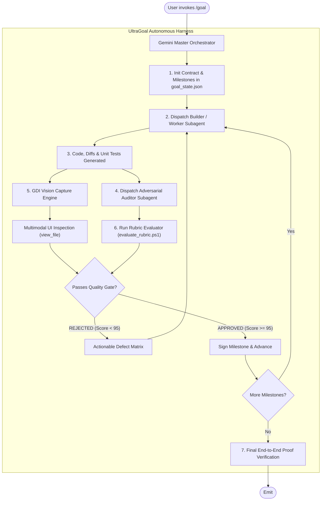

<div align="center">

# ⚡ UltraGoal Engine v2.0
### The Relentless Multi-Agent Perfectionist Harness for Google Antigravity & OpenClaw

[](https://opensource.org/licenses/MIT)
[](https://deepmind.google/technologies/gemini/)
[](https://github.com/openclaw)
[](#-the-perfectionist-rubric)
[](#-verification-suite)

**Autonomous, unstoppable co-agent loop designed for complex engineering projects. Never settles for mediocre code, mock stubs, or unverified results.**

[Español](#-visión-general-en-español) • [English](#-english-overview) • [Architecture](#-architecture) • [Installation](#-quick-installation) • [Examples](#-demo-flow)

---

</div>

## 🇪🇸 Visión General en Español

**UltraGoal** es un arnés multi-agente de ingeniería de software autónomo para **Google Antigravity** y **OpenClaw**. Transforma el comando `/goal` de una ejecución lineal ordinaria en un **equipo autónomo de ingeniería de software** compuesto por una tríada de agentes coordinados:

1. **El Agente Constructor (Worker / Doer):** Desarrolla el código, módulos, pruebas y dependencias. No ensucia el contexto global del agente principal.
2. **El Agente Auditor Crítico (Gemini Critic / Red Team):** Revisa cada entrega con mentalidad adversarial. Aplica un escáner automatizado de rúbrica estricta (100 puntos). **Rechaza de forma no negociable cualquier entrega con puntaje menor a 95**.
3. **El Ojo de Gemini (Multimodal Vision Eye):** Captura pantallas e interfaces en tiempo real mediante GDI nativo de alta resolución y las procesa con visión artificial multimodal para verificar diseño, fuentes, alineación y responsividad visual.

> 💎 **Invariante Cero-Conformismo:** Queda terminantemente prohibido dar por finalizada una tarea con código stub (`TODO`, `FIXME`, `pass`, `NotImplementedException`), pruebas ausentes o errores no capturados.

---

## 🇺🇸 English Overview

**UltraGoal** is a resilient, multi-agent autonomous harness for **Google Antigravity** and **OpenClaw**. It elevates `/goal` from a naive single-threaded loop into an **uncompromising autonomous software engineering triad**:

- **The Builder Agent (Worker):** Implements features, refactors files, and executes builds in isolated subagent contexts.
- **The Adversarial Auditor (Critic):** Evaluates every commit against an empirical 100-point rubric. **Enforces a strict >= 95/100 threshold**. If the code has missing tests, silent catch blocks, or mock stubs, the milestone is vetoed and returned for correction.
- **The Vision Inspector (Eye of Gemini):** Captures high-resolution desktop and window states via native Win32 GDI, feeding screenshots directly into Gemini's multimodal vision engine to audit UI/UX fidelity, layout stability, and CLI rendering.

---

## 🏛️ Architecture



---

## 📊 Comparison: Standard Goal vs UltraGoal

| Dimension | Standard Agent Loops | UltraGoal Harness (v2.0) |
| :--- | :--- | :--- |
| **Verification** | Superficial ("runs without error") | **Rigorous 100-point Rubric Gate (Min: 95)** |
| **Code Completeness** | Frequently leaves `# TODO` / stubs | **Zero TODOs / Stubs permitted** |
| **Vision Auditing** | Blind (no visual check) | **Multimodal GDI Screen & Window capture** |
| **Subagent Topology** | Single monolith context | **Triad: Orchestrator + Builder + Auditor** |
| **Context Management** | Context bloat & hallucination | **Subagent isolation + rotating logs** |
| **Failure Recovery** | Often loops or gives up | **Actionable remediation feedback loops** |

---

## 📦 Project Structure

```text
antigravity-ultra-goal/
├── SKILL.md                          # Core Skill Definition for Antigravity & OpenClaw
├── LICENSE                           # MIT License
├── README.md                         # Documentation & Architecture Guide
├── CONTRIBUTING.md                   # Contribution Guidelines
├── scripts/
│   ├── capture_vision.ps1            # Ultra-resilient GDI screen & window capture
│   ├── evaluate_rubric.ps1           # Anti-sloth code quality & test scanner
│   └── milestone_tracker.ps1         # State machine & auditable milestone ledger
├── templates/
│   ├── CONTRACT_TEMPLATE.md          # Acceptance criteria master contract
│   ├── AUDIT_REPORT_TEMPLATE.md      # Adversarial audit report format
│   └── VISION_AUDIT_TEMPLATE.md      # Multimodal UI review template
└── examples/
    ├── demo_workflow.md              # Real-world walkthrough scenario
    └── test_verification_suite.ps1   # Self-contained 9/9 automated test suite
```

---

## 🚀 Quick Installation

### In Google Antigravity:
Clone or copy this skill into your Antigravity skills directory:
```powershell
# Instalar en Antigravity
$target = "C:\Users\$env:USERNAME\.gemini\config\skills\goal"
if (Test-Path $target) { Copy-Item $target "$target`_backup" -Recurse -Force }
git clone https://github.com/BryanGM12/antigravity-ultra-goal.git $target
```

### In OpenClaw:
```powershell
# Instalar en OpenClaw
$target = "C:\Users\$env:USERNAME\.openclaw\skills\ultra-goal"
git clone https://github.com/BryanGM12/antigravity-ultra-goal.git $target
```

---

## 🛠️ Tooling & Scripts Deep Dive

### 1. `evaluate_rubric.ps1` (The Quality Gate)
Scans source files across `.py`, `.ts`, `.js`, `.cs`, `.go`, `.rs`, `.ps1`, etc., checking for:
- ❌ `TODO`, `FIXME`, `HACK`, `PLACEHOLDER`
- ❌ `NotImplementedException`, `pass`, empty stubs
- ❌ Silent `catch {}` / `except: pass`
- ❌ Hardcoded API keys, JWTs, private keys
- ❌ Absence of unit tests or test assertions
- ❌ Broken test executions

```powershell
powershell -ExecutionPolicy Bypass -File scripts/evaluate_rubric.ps1 -TargetPath "./src" -TestCommand "npm test"
```

### 2. `capture_vision.ps1` (GDI Vision Capture)
Takes screenshots using low-level Win32 GDI APIs (`BitBlt` and `PrintWindow`) to work seamlessly even in remote, virtual, or background desktop sessions:
```powershell
powershell -ExecutionPolicy Bypass -File scripts/capture_vision.ps1 -ConversationId "<CurrentConversationId>" -ProcessName "chrome"
```

### 3. `milestone_tracker.ps1` (State Machine)
Maintains `goal_state.json`, tracking milestone progression, builder submissions, and auditor verdicts with cryptographic clarity:
```powershell
# Init
powershell -ExecutionPolicy Bypass -File scripts/milestone_tracker.ps1 -Action init -GoalTitle "Compiler Engine" -Milestones "Lexer;Parser;Codegen"

# Submit & Audit
powershell -ExecutionPolicy Bypass -File scripts/milestone_tracker.ps1 -Action submit -MilestoneIndex 1 -Notes "Lexer complete"
powershell -ExecutionPolicy Bypass -File scripts/milestone_tracker.ps1 -Action audit -MilestoneIndex 1 -Score 98 -Verdict "APPROVED" -Notes "100% test coverage"
```

---

## 🧪 Verification Suite

Run the full integration test suite to verify the entire harness in your local environment:
```powershell
powershell -ExecutionPolicy Bypass -File examples/test_verification_suite.ps1
```
Output:
```text
=================================================
   ULTRAGOAL HARNESS INTEGRATION TEST SUITE       
=================================================

[Test 1] Evaluando Milestone Tracker State Machine...
  [PASS] Tracker Init
  [PASS] Tracker Submit Status
  [PASS] Tracker Audit Rejection
  [PASS] Tracker Audit Approval
  [PASS] Tracker Final Completion

[Test 2] Evaluando Rubric Quality Gate...
  [PASS] Rubric Rejects Sloth Code
  [PASS] Rubric Approves Clean Code

[Test 3] Evaluando GDI Vision Capture Engine...
  [PASS] Vision Capture File Created
  [PASS] Vision Capture JSON Output

=================================================
   RESULTADOS: 9 PASADAS, 0 FALLIDAS
=================================================
```

---

## 📜 License

Distributed under the **MIT License**. Created with precision by **BryanGM12 & Antigravity Autonomous Systems**.