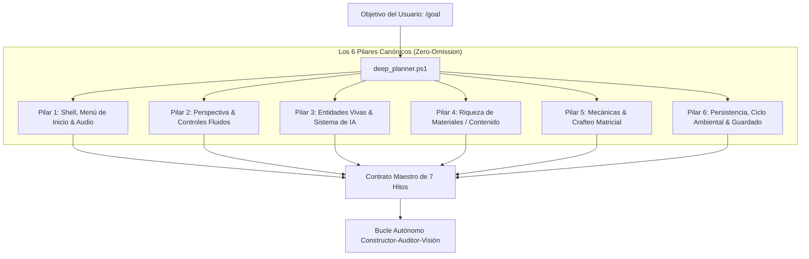

<div align="center">

# ⚡ UltraGoal Engine v3.0
### The Relentless Multi-Agent Perfectionist Harness for Google Antigravity & OpenClaw
**Deep Domain Research • Anti-Toy Pre-Mortem • AVS 1:1 Vision • Uncompromising Quality Gate**

[](https://opensource.org/licenses/MIT)
[](https://deepmind.google/technologies/gemini/)
[](https://github.com/openclaw)
[](#-los-6-pilares-canónicos-de-ingeniería)
[](#-escrutinio-visual-adversarial-avs-11)
[](#-rúbrica-y-barrera-anti-juguete)
[](#-verification-suite)

**Autonomous, unstoppable engineering harness. Eliminates the "Toy Demo Syndrome", detects invisible ground bugs, audits real-time drag-and-drop interactions, and enforces 60 FPS fluidity.**

[Español](#-visión-general-en-español-v30) • [English](#-english-overview-v30) • [Deep Planner & Anti-Toy](#-el-motor-de-planificación-profunda-deep_plannerps1) • [AVS Vision](#-escrutinio-visual-adversarial-avs-11) • [Architecture](#-architecture) • [Installation](#-quick-installation)

---

</div>

## 🇪🇸 Visión General en Español (v3.0)

**UltraGoal v3.0 (Deep Exhaustive Architecture)** ataca y destruye el mayor vicio de los modelos de lenguaje: el **Síndrome de la Demo de Juguete (Toy Demo Syndrome)**. Cuando un usuario le pide a una IA una meta ambiciosa con un prompt corto (ej. *"haz un clon de Minecraft tal cual"* o *"haz un clon de Trello"*), los modelos tradicionales toman atajos mediocres:
- Crean un juego sin menú de inicio real (solo un cartel feo de "click para continuar").
- Dejan el mundo completamente vacío y muerto, sin animales ni enemigos con IA.
- Omiten la cámara en tercera persona (solo primera persona fija).
- Ponen solo 2 o 3 tipos de bloques en vez de un catálogo geológico completo.
- Falsifican el crafteo con un botón simulado en lugar de una cuadrícula matricial con recetas.

### 🛡️ ¿Cómo lo soluciona UltraGoal v3.0?
1. **Investigación Profunda & Mapeo Canónico (`deep_planner.ps1`):**
   - Antes de escribir una sola línea de código, descompone la meta en los **6 Pilares Canónicos de Ingeniería**.
   - Prohíbe planes superficiales de 3 hitos. Genera automáticamente **6 a 7 hitos profundos** que cubren todo el espectro del software.
2. **Análisis Pre-Mortem Anti-Juguete:**
   - Anticipa las 5 formas en que el proyecto podría quedar como una maqueta mediocre y redacta **Cláusulas de Defensa No Negociables** en el contrato.
3. **Barrera Anti-Juguete en la Rúbrica (`evaluate_rubric.ps1`):**
   - Si el código de un juego carece de menús de inicio con ajustes, de criaturas vivas con IA, de cambio de cámara F5 o de motor de recetas, la rúbrica le descuenta puntos automáticamente y **RECHAZA la entrega** (Score < 95).
4. **Escrutinio Visual Adversarial (AVS 1:1) & Heatmap Diferencial:**
   - Recortes nativos 1:1 (`sector_ground.png`, `sector_hud.png`) para auditar bloques a nivel de píxel en el suelo y mapas de calor (`compare_visuals.ps1`) para verificar que los ítems sigan al cursor en el inventario.

---

## 🏛️ Los 6 Pilares Canónicos de Ingeniería

Todo proyecto bajo UltraGoal se desglosa rigurosamente en 6 subsistemas obligatorios:



1. **Pilar 1 (Shell, Menús & Audio):** Pantalla de título profesional con fondo animado, botón 'Jugar', botón 'Opciones' (audio, FOV, distancia), menú de pausa (ESC) y efectos de sonido SFX.
2. **Pilar 2 (Perspectiva & Controles):** Primera y Tercera Persona (F5), mira con wireframe delimitador y física sólida AABB con gravedad.
3. **Pilar 3 (Entidades Vivas & IA):** Animales pasivos (vacas, cerdos, ovejas) y enemigos hostiles con máquina de estados finitos (Wander, Idle, Chase, Attack).
4. **Pilar 4 (Riqueza de Materiales - Zero-Paucity):** Catálogo mínimo de 8 a 12 bloques con texturas diferenciadas por cara y capas geológicas en el terreno.
5. **Pilar 5 (Mecánicas Profundas & Crafteo Real):** Cuadrícula de crafteo 2x2 en inventario + 3x3 en Mesa de Trabajo con motor de recetas por diccionario, arrastre drag-and-drop con seguimiento de cursor y apilamiento (x64).
6. **Pilar 6 (Ambiente & Persistencia):** Ciclo día/noche con sol y luna, partículas de ruptura y guardado en disco / LocalStorage.

---

## 🇺🇸 English Overview (v3.0)

**UltraGoal v3.0** eradicates the **Toy Demo Syndrome** where AI agents generate hollow caricatures of complex software:
- **Autonomous Domain Expansion (`deep_planner.ps1`):** Decomposes ambiguous requests into an exhaustive 6-Pillar technical specification before code generation.
- **Anti-Toy Pre-Mortem Gate:** Identifies the top 5 ways the project could degrade into a naive mockup and turns them into binding verification contracts.
- **Anti-Toy Rubric Veto:** Deducts points and rejects pull requests lacking start menus, mob AI, multi-perspective cameras, or extensible recipe engines.
- **AVS 1:1 Multi-Sector Vision:** Native pixel crops to inspect ground-level geometry, HUD typography, and differential interaction heatmaps.

---

## 📦 Project Structure

```text
antigravity-ultra-goal/
├── SKILL.md                          # Core Skill Definition (v3.0)
├── LICENSE                           # MIT License
├── README.md                         # Documentation & Architecture Guide
├── CONTRIBUTING.md                   # Contribution Guidelines
├── scripts/
│   ├── deep_planner.ps1              # Deep domain decomposition & anti-toy pre-mortem
│   ├── capture_vision.ps1            # Multi-Sector 1:1 crops, Grid Overlay & Burst capture
│   ├── compare_visuals.ps1           # Differential heatmap & interaction tracker
│   ├── evaluate_rubric.ps1           # Anti-sloth, anti-toy & performance quality scanner
│   └── milestone_tracker.ps1         # State machine & auditable milestone ledger
├── templates/
│   ├── SPECIFICATION_TEMPLATE.md     # Exhaustive 6-Pillar domain technical specification
│   ├── CONTRACT_TEMPLATE.md          # Acceptance criteria master contract
│   ├── AUDIT_REPORT_TEMPLATE.md      # Adversarial audit report format
│   └── VISION_AUDIT_TEMPLATE.md      # 7-Vector adversarial visual scrutiny format
└── examples/
    ├── demo_workflow.md              # Real-world walkthrough scenario
    └── test_verification_suite.ps1   # 14/14 automated integration test suite
```

---

## 🚀 Quick Installation

### In Google Antigravity:
```powershell
$target = "C:\Users\$env:USERNAME\.gemini\config\skills\goal"
if (Test-Path $target) { Copy-Item $target "$target`_backup" -Recurse -Force }
git clone https://github.com/BryanGM12/antigravity-ultra-goal.git $target
```

### In OpenClaw:
```powershell
$target = "C:\Users\$env:USERNAME\.openclaw\skills\ultra-goal"
git clone https://github.com/BryanGM12/antigravity-ultra-goal.git $target
```

---

## 🧪 Verification Suite (14/14 Passing)

Run the full integration test suite:
```powershell
powershell -ExecutionPolicy Bypass -File examples/test_verification_suite.ps1
```
Output:
```text
=================================================
   ULTRAGOAL HARNESS INTEGRATION TEST SUITE v3.0 
=================================================

[Test 1] Evaluando Deep Domain Planner & Anti-Toy Pre-Mortem...
  [PASS] Deep Planner Generates Spec File
  [PASS] Deep Planner Detects Game Domain
  [PASS] Deep Planner Decomposes 6 Pillars
  [PASS] Deep Planner Formulates Anti-Toy Defenses

[Test 2] Evaluando Milestone Tracker State Machine...
  [PASS] Tracker Init with Deep Milestones
  [PASS] Tracker Has 7 Deep Milestones

[Test 3] Evaluando Rubric Anti-Toy & Performance Gate...
  [PASS] Rubric Rejects Shallow Toy Demo (Score < 95 REJECTED)
  [PASS] Rubric Approves Deep Architecture Code (Score 100 APPROVED)

[Test 4] Evaluando MultiSector Vision Engine...
  [PASS] MultiSector Full Image Generated
  [PASS] Ground Sector 1:1 Crop Generated
  [PASS] Center Focus 1:1 Crop Generated
  [PASS] HUD Inventory 1:1 Crop Generated

[Test 5] Evaluando Visual Differencing Engine (compare_visuals)...
  [PASS] Visual Diff State Change Detected
  [PASS] Visual Diff Heatmap Image Created

=================================================
   RESULTADOS: 14 PASADAS, 0 FALLIDAS (100%)
=================================================
```

---

## 📜 License

Distributed under the **MIT License**. Created with precision by **BryanGM12 & Antigravity Autonomous Systems**.