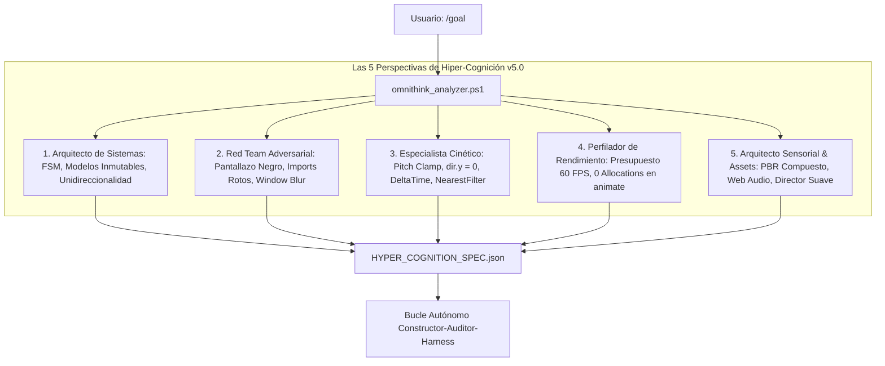

<div align="center">

# ⚡ UltraGoal Universal Engine v5.0
### The Autonomous Software Engineering Triad for Google Antigravity & OpenClaw
**OmniThink 5-Perspective Hyper-Cognition • Asset & Sensory Orchestrator • Procedural Web Audio • Cinematic Flight Director • 5-Phase Rigorous Test Harness**

[](https://opensource.org/licenses/MIT)
[](https://deepmind.google/technologies/gemini/)
[](https://github.com/openclaw)
[](#-fase-0-omnithink-hyper-cognition-5-perspectivas)
[](#-orquestador-de-assets-y-paisaje-sonoro)
[](#-motor-de-audio-procedural)
[](#-la-batería-de-pruebas-rigurosa-de-5-fases)
[](#-verification-suite-2323-passing)

**Autonomous engineering harness that "thinks through absolutely everything" before coding, sources high-fidelity assets, synthesizes procedural audio, and tests through 5 relentless phases.**

[Español](#-visión-general-en-español-v50) • [English](#-english-overview-v50) • [OmniThink](#-fase-0-omnithink-hyper-cognition-5-perspectivas) • [Asset Orchestrator](#-orquestador-de-assets-y-paisaje-sonoro) • [5-Phase Harness](#-la-batería-de-pruebas-rigurosa-de-5-fases) • [Verification Suite](#-verification-suite-2323-passing)

---

</div>

## 🇪🇸 Visión General en Español (v5.0)

**UltraGoal Universal v5.0** erradica el "Síndrome de la Demo de Juguete" no solo en la lógica de negocio, sino también en la **fidelidad visual, sonora y cinética**. Resuelve los problemas clásicos de simulaciones y animaciones generadas por IA:
1. **Modelos 3D de baja calidad:** Mallas primitivas básicas (un cilindro o caja desnuda) reemplazadas por **mallas compuestas jerárquicas con materiales PBR** y toberas detalladas.
2. **Simulaciones mudas:** Integración obligatoria de **síntesis procedural de audio con Web Audio API** (rugido de cohetes con pink noise, beeps de cuenta atrás, desacople y RCS).
3. **Cámaras y movimientos con tirones/bugs:** Implementación de un **Director de Vuelo Cinematográfico** con interpolación suave (`lerp`/`slerp`) entre ángulos de cámara y fases de vuelo.
4. **Obtención activa de recursos externos:** El agente consulta `asset_orchestrator.ps1` y realiza búsquedas web para enlazar texturas 4K de la NASA, skyboxes estelares y modelos GLTF.

---

## 🧠 Fase 0: OmniThink Hyper-Cognition (5 Perspectivas)

Antes de escribir una sola línea de código, `scripts/omnithink_analyzer.ps1` analiza la meta a través de **5 Perspectivas Críticas**:



---

## 🚀 Orquestador de Assets y Paisaje Sonoro (`asset_orchestrator.ps1`)

Para erradicar primitivas desnudas y simulaciones silenciosas:
```powershell
powershell -ExecutionPolicy Bypass -File scripts/asset_orchestrator.ps1 -Domain "Space_Rocket"
```

Ofrece:
- **Catálogo de Texturas Planetarias:** Texturas oficiales de la NASA (Tierra día/noche 2048, specular/normal maps, nubes, Luna 1024/4K, Vía Láctea).
- **Generador de Mallas Compuestas 3D:** `createHighFidelityMultiStageRocket` con etapas desacoplables (Booster Stage 1, Orbital Stage 2, Apollo Capsule), cluster de 5 toberas F-1 con fulgor térmico emisivo y aletas estabilizadoras.
- **Motor de Audio Procedural Web Audio API:** Rugido pink noise + low-pass resonante biquad con modulación de empuje, beeps de cuenta regresiva, impacto de desacople de pernos explosivos y ráfagas RCS.
- **Director de Vuelo Cinematográfico:** Modos multicámara (plataforma Pad Tracking, Booster Cam mirando a la Tierra, Chase Cam orbital, vista de cabina) con amortiguación `lerp` que previene sacudidas.

---

## 🧪 La Batería de Pruebas Rigurosa de 5 Fases

Ningún proyecto puede ser entregado sin haber aprobado el arnés [rigorous_test_harness.ps1](file:///C:/Users/Administrator/.gemini/config/skills/goal/scripts/rigorous_test_harness.ps1):

| Fase de Prueba | Qué Audita Empíricamente | Criterio de Rechazo Inmediato |
| :--- | :--- | :--- |
| **Fase 1: Estático & AST** | Sintaxis, compatibilidad ES modules y ausencia total de stubs | Declaraciones `import` sin `type="module"`, TODOs, FIXMEs o catch vacíos. |
| **Fase 2: Arranque en Vivo** | Ejecución real en Chrome Headless (`verify_runtime_boot.ps1`) | Si la app no arranca, crashea o genera errores de consola. |
| **Fase 3: Escrutinio Visual** | Varianza de luminancia de píxeles y filtrado de texturas | Desviación estándar < 3.0 (pantallazo negro/blanco) o texturas vóxel sin `NearestFilter`. |
| **Fase 4: Estabilidad Cinética & Sensorial** | Cámara, física DeltaTime, audio procedural y mallas compuestas | Volteos de cámara en primera persona, simulaciones mudas o cohetes modelados con un cilindro simple. |
| **Fase 5: Pruebas Automatizadas** | Ejecución de suite de tests con aserciones formales | Exit code distinto de 0 o menos de 3 aserciones verificadas. |

---

## 🇺🇸 English Overview (v5.0)

**UltraGoal Universal v5.0** sets a new benchmark for autonomous software creation:
- **OmniThink Pre-Mortem (5 Perspectives):** Analyzes architecture, adversarial vectors, kinetic ergonomics, performance budgets, and **sensory asset orchestration** before coding.
- **Asset & Resource Orchestrator (`asset_orchestrator.ps1`):** Supplies verified NASA planetary textures, procedural multi-stage PBR rocket meshes, and smooth cinematic camera rigs.
- **Procedural Web Audio Engine:** Web Audio API sound synthesis (rocket pink noise rumble, countdown quindar beeps, staging separation thuds, RCS thruster puffs) with zero broken link risks.
- **Cinematic Camera Director:** Multi-view tracking with smooth `lerp`/`slerp` interpolation preventing jerky camera jumps and trajectory glitches.
- **5-Phase Rigorous Test Harness:** Rejects silent simulations, bare single-cylinder toy models, black screens, and unhandled exceptions.

---

## 📦 Project Structure

```text
antigravity-ultra-goal/
├── SKILL.md                          # Skill Definition v5.0 (OmniThink & Asset Orchestrator)
├── LICENSE                           # MIT License
├── README.md                         # Bilingual Documentation & Benchmarks
├── CONTRIBUTING.md                   # Contribution Guidelines
├── resources/
│   └── procedural_audio_engine.js    # Drop-in Web Audio API synthesizer module
├── scripts/
│   ├── asset_orchestrator.ps1        # High-Fidelity 3D Assets, Shaders & Soundscapes (NEW)
│   ├── omnithink_analyzer.ps1        # System 2 Hyper-Cognition & 5-Perspective Reasoner (UPDATED)
│   ├── rigorous_test_harness.ps1     # 5-Phase Deep Autonomous Test Harness (UPDATED)
│   ├── verify_runtime_boot.ps1       # Live headless boot & black screen detector
│   ├── capture_vision.ps1            # Multi-State 4-photo gallery & luminance analyzer
│   ├── compare_visuals.ps1           # Differential heatmap & interaction tracker
│   ├── deep_planner.ps1              # Universal 7-Tier planner with sensory mandates
│   ├── evaluate_rubric.ps1           # 100-point rubric with Kinetic_Asset_Integrity gate
│   └── milestone_tracker.ps1         # State machine & auditable milestone ledger
├── templates/
│   ├── SPECIFICATION_TEMPLATE.md     # Universal 7-Tier specification template
│   ├── CONTRACT_TEMPLATE.md          # Acceptance criteria master contract
│   ├── AUDIT_REPORT_TEMPLATE.md      # Adversarial audit report format
│   └── VISION_AUDIT_TEMPLATE.md      # 7-Vector visual scrutiny checklist
└── examples/
    ├── demo_workflow.md              # Real-world walkthrough scenario
    └── test_verification_suite.ps1   # 23/23 automated integration test suite
```

---

## 🧪 Verification Suite (23/23 Passing)

Run the full integration test suite:
```powershell
powershell -ExecutionPolicy Bypass -File examples/test_verification_suite.ps1
```
Output:
```text
=================================================
   ULTRAGOAL HARNESS TEST SUITE v5.0 (ASSETS & AUDIO) 
=================================================
  [PASS] OmniThink Analyzes 5 Perspectives
  [PASS] OmniThink Red Team Identifies Critical Vectors
  [PASS] OmniThink Visual/Kinetic Mandates Exist
  [PASS] OmniThink Sensory & Asset Orchestrator Rules Exist
  [PASS] Planner Identifies Game Domain
  [PASS] Planner Enforces Kinetic & NearestFilter Defenses
  [PASS] Tracker Init with Deep Milestones
  [PASS] Live Boot Catches Broken Syntax & Black Screen
  [PASS] Live Boot Approves Running Game
  [PASS] Harness Rejects Broken Code (Defects >= 5)
  [PASS] Harness Approves Clean Code (0 Defects)
  [PASS] Rubric Approves Clean Kinetic & NearestFilter Code
  [PASS] Overview Grid Generated
  [PASS] Ground Sector 1:1 Generated
  [PASS] Center Focus 1:1 Generated
  [PASS] HUD Inventory 1:1 Generated
  [PASS] Visual Diff State Change Detected
  [PASS] Orchestrator Supplies Space Texture Catalog
  [PASS] Orchestrator Exports Composite Rocket Mesh Code
  [PASS] Orchestrator Exports Procedural Web Audio Engine
  [PASS] Orchestrator Exports Cinematic Flight Director
  [PASS] Harness Rejects Silent & Flat-Cylinder Rocket Simulation
  [PASS] Harness Approves High-Fidelity Rocket with Web Audio & Smooth Camera
=================================================
   RESULTADOS: 23 PASADAS, 0 FALLIDAS (100%)
=================================================
```

---

## 📜 License

Distributed under the **MIT License**. Created by **BryanGM12 & Antigravity Autonomous Systems**.