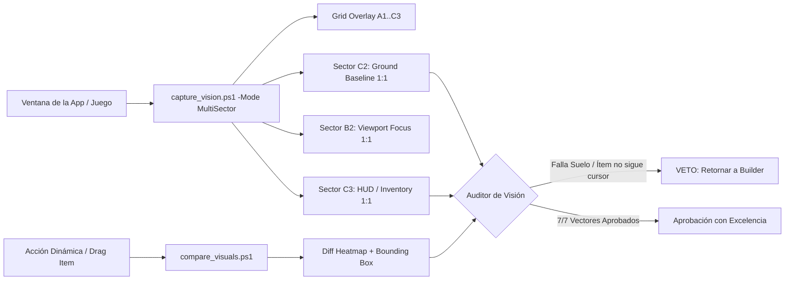

<div align="center">

# ⚡ UltraGoal Engine v2.1
### The Relentless Multi-Agent Perfectionist Harness for Google Antigravity & OpenClaw

[](https://opensource.org/licenses/MIT)
[](https://deepmind.google/technologies/gemini/)
[](https://github.com/openclaw)
[](#-adversarial-visual-scrutiny-avs)
[](#-the-perfectionist-rubric)
[](#-verification-suite)

**Autonomous, unstoppable co-agent loop designed for complex engineering projects. Never settles for mediocre code, invisible ground bugs, unattached inventory items, or stuttering performance.**

[Español](#-visión-general-en-español) • [English](#-english-overview) • [AVS Vision Deep Dive](#-avs-adversarial-visual-scrutiny) • [Architecture](#-architecture) • [Installation](#-quick-installation)

---

</div>

## 🇪🇸 Visión General en Español (v2.1)

**UltraGoal v2.1** resuelve de raíz las debilidades de los agentes de IA al ejecutar metas complejas: la **ceguera ante pequeños detalles visuales**, la **falta de seguimiento dinámico en interacciones (drag-and-drop)** y la **mala optimización/stutter en motores gráficos y UIs**.

### 🔍 ¿Qué novedades incluye la versión 2.1?
1. **Escrutinio Visual Adversarial (AVS):**
   - Elimina la complacencia de los modelos de visión que aprueban escenas de lejos sin ver los detalles.
   - **Recortes Multi-Sector 1:1 (`sector_ground.png`, `sector_hud.png`, `sector_center.png`):** Extrae áreas críticas en resolución nativa para auditar si los bloques descansan sobre el suelo real (Y=0), si las fuentes del HUD son nítidas o si faltan caras de polígonos.
2. **Motor de Diferenciación Visual Interactiva (`compare_visuals.ps1`):**
   - Audita interacciones dinámicas en tiempo real (ej. abrir inventario, seleccionar un objeto y arrastrarlo).
   - Genera un **mapa de calor diferencial (Heatmap)** con bounding box amarillo y resaltado magenta. Si el objeto arrastrado no sigue las coordenadas del puntero, el auditor emite un **VETO inmediato**.
3. **Filtro Estricto de Rendimiento & Cero-Stutter:**
   - Escanea el código en busca de cuellos de botella en bucles de animación (`requestAnimationFrame` / `animate()`): penaliza asignaciones continuas de memoria (`new THREE.Vector3()`) que causan pausas de Garbage Collector y caídas de FPS.
   - Exige `InstancedMesh` o combinación de geometrías para terrenos de vóxeles y juegos 3D.

---

## 🇺🇸 English Overview (v2.1)

**UltraGoal v2.1** addresses the primary blind spots in autonomous agentic loops: **micro-visual detail blindness**, **detached interactive states (e.g. inventory items not tracking the cursor)**, and **unoptimized render stuttering**.

- **Multi-Sector 1:1 Native Crops (`capture_vision.ps1 -Mode MultiSector`):** Prevents downsampling loss by slicing high-resolution sub-regions (`sector_ground`, `sector_hud`, `sector_center`) so Gemini inspects ground plane continuity, textures, and UI slot typography at pixel-level accuracy.
- **Differential Interaction Heatmaps (`compare_visuals.ps1`):** Compares pre- and post-interaction frames. If a dragged item fails to follow cursor coordinates, or if state transitions freeze, the differential engine flags a visual anomaly with bounding box coordinates.
- **Render Loop Profiling Gate (`evaluate_rubric.ps1`):** Flags allocations inside render loops, unthrottled ticks, and unbatched geometry, enforcing 60 FPS fluidity.

---

## 👁️ AVS: Adversarial Visual Scrutiny Protocol



### Los 7 Vectores Críticos de Falla Visual Auditados:
1. **Línea Base & Superficie:** ¿Los bloques tocan el suelo o quedan flotando/invisibles?
2. **Seguimiento de Cursor:** Al arrastrar en el inventario, ¿el sprite acompaña las coordenadas del puntero?
3. **Integridad de Mallas & Texturas:** ¿Hay huecos entre vóxeles o caras invisibles?
4. **Z-Index & Oclusión:** ¿La UI queda tapada por el mundo 3D?
5. **Legibilidad Micro:** ¿Los números de cantidad (ej. x64) son nítidos en el recorte 1:1?
6. **Delta de Interacción Confirmado:** ¿La acción generó un delta visual observable en el mapa de calor?
7. **Estabilidad de Cuadros:** ¿Se preserva la tasa de refresco sin pausas de memoria?

---

## 🏛️ Architecture


---

## 📦 Project Structure

```text
antigravity-ultra-goal/
├── SKILL.md                          # Core Skill Definition (v2.1)
├── LICENSE                           # MIT License
├── README.md                         # Documentation & Architecture Guide
├── CONTRIBUTING.md                   # Contribution Guidelines
├── scripts/
│   ├── capture_vision.ps1            # Multi-Sector 1:1 crops, Grid Overlay & Burst capture
│   ├── compare_visuals.ps1           # Differential heatmap & interaction tracker
│   ├── evaluate_rubric.ps1           # Anti-sloth, anti-leak & performance quality scanner
│   └── milestone_tracker.ps1         # State machine & auditable milestone ledger
├── templates/
│   ├── CONTRACT_TEMPLATE.md          # Acceptance criteria master contract
│   ├── AUDIT_REPORT_TEMPLATE.md      # Adversarial audit report format
│   └── VISION_AUDIT_TEMPLATE.md      # 7-Vector adversarial visual scrutiny format
└── examples/
    ├── demo_workflow.md              # Real-world walkthrough scenario
    └── test_verification_suite.ps1   # 13/13 automated integration test suite
```

---

## 🚀 Quick Installation

### In Google Antigravity:
```powershell
$target = "C:\Users\$env:USERNAME\.gemini\config\skills\goal"
if (Test-Path $target) { Copy-Item $target "$target`_backup" -Recurse -Force }
git clone https://github.com/BryanGM12/antigravity-ultra-goal.git $target
```

### In OpenClaw:
```powershell
$target = "C:\Users\$env:USERNAME\.openclaw\skills\ultra-goal"
git clone https://github.com/BryanGM12/antigravity-ultra-goal.git $target
```

---

## 🧪 Verification Suite

Run the full integration test suite:
```powershell
powershell -ExecutionPolicy Bypass -File examples/test_verification_suite.ps1
```
Output:
```text
=================================================
   ULTRAGOAL HARNESS INTEGRATION TEST SUITE v2.1 
=================================================

[Test 1] Evaluando Milestone Tracker State Machine...
  [PASS] Tracker Init
  [PASS] Tracker Submit Status
  [PASS] Tracker Audit Rejection
  [PASS] Tracker Audit Approval
  [PASS] Tracker Final Completion

[Test 2] Evaluando Rubric Quality & Performance Gate...
  [PASS] Rubric Detects Render Allocation Bottleneck
  [PASS] Rubric Approves Clean Modular Code

[Test 3] Evaluando MultiSector Vision Engine...
  [PASS] MultiSector Full Image Generated
  [PASS] Ground Sector 1:1 Crop Generated
  [PASS] Center Focus 1:1 Crop Generated
  [PASS] HUD Inventory 1:1 Crop Generated

[Test 4] Evaluando Visual Differencing Engine (compare_visuals)...
  [PASS] Visual Diff State Change Detected
  [PASS] Visual Diff Heatmap Image Created

=================================================
   RESULTADOS: 13 PASADAS, 0 FALLIDAS (100%)
=================================================
```

---

## 📜 License

Distributed under the **MIT License**. Created by **BryanGM12 & Antigravity Autonomous Systems**.