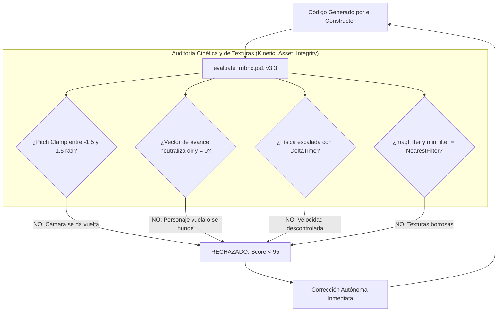

<div align="center">

# ⚡ UltraGoal Universal Engine v3.3
### The Autonomous Software Engineering Triad for Google Antigravity & OpenClaw
**Kinetic & Camera Stability • Pixel-Art Texture Integrity • Live Boot & Multi-Photo Scrutiny • Score ≥ 95**

[](https://opensource.org/licenses/MIT)
[](https://deepmind.google/technologies/gemini/)
[](https://github.com/openclaw)
[](#-el-invariante-cinético-y-de-texturas)
[](#-fidelidad-de-texturas-y-materiales)
[](#-el-invariante-de-arranque-en-vivo-zero-broken-boot)
[](#-verification-suite)

**Build production-grade 3D simulations, voxel engines, and web apps with stable cameras, crisp pixel-art textures, and zero runtime crashes.**

[Español](#-visión-general-en-español-v33) • [English](#-english-overview-v33) • [Cinética & Texturas](#-el-invariante-cinético-y-de-texturas) • [Live Boot](#-el-invariante-de-arranque-en-vivo-zero-broken-boot) • [Multi-Photo](#-protocolo-de-auditoría-de-múltiples-fotos) • [Installation](#-quick-installation)

---

</div>

## 🇪🇸 Visión General en Español (v3.3)

**UltraGoal Universal v3.3** erradica de forma definitiva los dos fallos más críticos y comunes en proyectos 3D y juegos generados por IA:
1. **Cámara y Controles Rotos (Bugs de Movimiento):**
   - Cámaras que se dan vuelta boca abajo al mover el ratón (falta de pitch clamping).
   - Personajes que "vuelan" al mirar hacia arriba o se hunden al mirar al suelo (falta de neutralización del eje Y en el vector de avance).
   - Movimiento errático dependiente de la tasa de refresco (falta de `DeltaTime`).
2. **Texturas Horribles / Plásticas:**
   - Bloques con un solo color plano o texturas borrosas tipo smudge causadas por el filtrado bilineal por defecto de Three.js.

---

## 🕹️ El Invariante Cinético y de Texturas

La rúbrica [evaluate_rubric.ps1](file:///C:/Users/Administrator/.gemini/config/skills/goal/scripts/evaluate_rubric.ps1) audita y **VETA AUTOMÁTICAMENTE** cualquier código que viole estos estándares:



### 1. Bloqueo de Cabeceo de Cámara (Anti-Flip Clamping)
- **El Bug:** Al mover el ratón verticalmente, la cámara rota más de 90° e invierte el mundo al revés.
- **Defensa Obligatoria:** Clamping estricto de la rotación vertical entre `-1.5` y `1.5` radianes (`Math.max(-1.5, Math.min(1.5, pitch))`).

### 2. Neutralización del Eje Y en Avance (Anti-Flying Bug)
- **El Bug:** Al presionar W mirando hacia el cielo, el vector de avance tiene componente Y positiva y el personaje vuela; mirando al suelo, se hunde.
- **Defensa Obligatoria:** `dir.y = 0; dir.normalize();` antes de sumar al desplazamiento.

### 3. Físicas con DeltaTime (Anti-Framerate Stutter)
- **Defensa Obligatoria:** Integrar siempre `const dt = clock.getDelta();` en todas las traslaciones físicas.

### 4. Texturas Vóxel Nítidas (Anti-Blurry Textures)
- **Defensa Obligatoria:** Forzar `texture.magFilter = THREE.NearestFilter; texture.minFilter = THREE.NearestFilter; texture.generateMipmaps = false;`.
- **Mapeo por Caras Diferenciadas:** Cada bloque de pasto debe poseer cara superior verde con ruido procedural, laterales con manto de césped sobre tierra y base de tierra pura.

---

## 🚫 El Invariante de Arranque en Vivo (Zero-Broken-Boot)

Ningún proyecto puede entregarse sin haber arrancado en **Chrome Headless** con `verify_runtime_boot.ps1`:
- **Detector de Pantallazo Negro:** Si la pantalla permanece negra (`#000000`) o con desviación estándar < 3.0, la entrega queda vetada de inmediato.
- **Inspección Pre-Vuelo:** Veta scripts con `import` sin `type="module"` y archivos referenciados inexistentes.

---

## 📸 Protocolo de Auditoría de Múltiples Fotos

El Auditor debe ejecutar `capture_vision.ps1 -Mode MultiStateAudit` y examinar con `view_file`:
1. `1_overview_grid.png`: Vista panorámica con cuadrícula `[A1]..[C3]`.
2. `2_sector_center.png`: Recorte 1:1 del centro (mira, wireframe del bloque seleccionado y horizonte).
3. `3_sector_ground.png`: Recorte 1:1 del suelo (para verificar que los bloques toquen el piso Y=0 y que las texturas sean nítidas).
4. `4_sector_hud.png`: Recorte 1:1 del inventario y números de ítems.

---

## 🇺🇸 English Overview (v3.3)

**UltraGoal Universal v3.3** tackles broken 3D game controls and muddy textures:
- **Kinetic & Camera Stability Gate:** Enforces camera pitch clamping ($-1.5$ to $1.5$ rad) to prevent upside-down camera flips, Y-axis movement flattening (`dir.y = 0`) to prevent flying/sinking, and DeltaTime physics.
- **Pixel-Art Texture Filtering:** Mandates `THREE.NearestFilter` on all voxel textures to prevent blurry, washed-out textures. Requires multi-face cube mapping.
- **Zero-Broken-Boot Gate:** Verifies runtime execution in headless Chrome before completion.
- **Multi-Photo AVS Audit:** 4-photo inspection gallery of overview, ground, HUD, and focal center.

---

## 📦 Project Structure

```text
antigravity-ultra-goal/
├── SKILL.md                          # Skill Definition v3.3 (Kinetic & Texture Integrity)
├── LICENSE                           # MIT License
├── README.md                         # Bilingual Documentation & Benchmarks
├── CONTRIBUTING.md                   # Contribution Guidelines
├── scripts/
│   ├── verify_runtime_boot.ps1       # Live headless boot & black screen detector
│   ├── capture_vision.ps1            # Multi-State 4-photo gallery & luminance analyzer
│   ├── compare_visuals.ps1           # Differential heatmap & interaction tracker
│   ├── deep_planner.ps1              # Universal 7-Tier planner with kinetic mandates
│   ├── evaluate_rubric.ps1           # 100-point rubric with Kinetic_Asset_Integrity gate
│   └── milestone_tracker.ps1         # State machine & auditable milestone ledger
├── templates/
│   ├── SPECIFICATION_TEMPLATE.md     # Universal 7-Tier specification template
│   ├── CONTRACT_TEMPLATE.md          # Acceptance criteria master contract
│   ├── AUDIT_REPORT_TEMPLATE.md      # Adversarial audit report format
│   └── VISION_AUDIT_TEMPLATE.md      # 7-Vector visual scrutiny checklist
└── examples/
    ├── demo_workflow.md              # Real-world walkthrough scenario
    └── test_verification_suite.ps1   # 15/15 automated integration test suite
```

---

## 🧪 Verification Suite (15/15 Passing)

Run the full integration test suite:
```powershell
powershell -ExecutionPolicy Bypass -File examples/test_verification_suite.ps1
```
Output:
```text
=================================================
   ULTRAGOAL HARNESS TEST SUITE v3.3 (KINETICS)  
=================================================
  [PASS] Planner Identifies Game Domain
  [PASS] Planner Enforces Kinetic & NearestFilter Defenses
  [PASS] Tracker Init with Deep Milestones
  [PASS] Live Boot Catches Broken Syntax & Black Screen
  [PASS] Live Boot Approves Running Game
  [PASS] Rubric Rejects Broken Camera & Blurry Textures
  [PASS] Rubric Catches Camera Pitch Flip Bug
  [PASS] Rubric Catches Flying Movement Bug
  [PASS] Rubric Catches Missing DeltaTime Bug
  [PASS] Rubric Approves Clean Kinetic & NearestFilter Code
  [PASS] Overview Grid Generated
  [PASS] Ground Sector 1:1 Generated
  [PASS] Center Focus 1:1 Generated
  [PASS] HUD Inventory 1:1 Generated
  [PASS] Visual Diff State Change Detected
=================================================
   RESULTADOS: 15 PASADAS, 0 FALLIDAS (100%)
=================================================
```

---

## 📜 License

Distributed under the **MIT License**. Created by **BryanGM12 & Antigravity Autonomous Systems**.