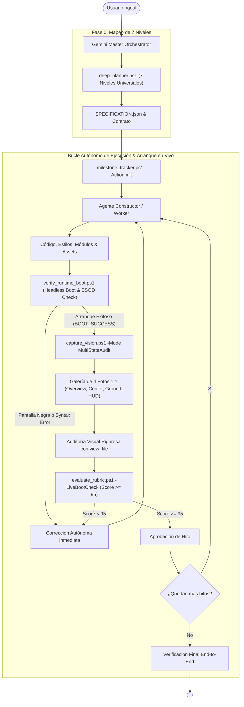

---
name: goal
description: "Motor Autónomo Perfeccionista Universal v3.2 (UltraGoal Engine - Live Boot & Multi-Photo Scrutiny). Erradica los proyectos rotos que no inician o quedan en pantalla negra. Incorpora Verificación de Arranque en Vivo (verify_runtime_boot.ps1), Detección de Pantalla Negra (BSOD Gate), Galería de Múltiples Fotos (capture_vision MultiStateAudit), Autocorrección Autónoma (Cero Babysitting) y Rúbrica >= 95/100."
author: BryanGM12 & Antigravity Autonomous Systems
version: 3.2.0
metadata:
  category: orchestration
  skills: ["goal", "live-runtime-boot", "dead-screen-gate", "multi-photo-vision", "universal-engineering", "autonomous-self-healing", "quality-gate"]
---

# ⚡ UltraGoal Universal Engine v3.2
### Live Runtime Boot Verification • Dead-Screen Gate • Multi-Photo Visual Scrutiny

Cuando el usuario invoca `/goal <objetivo>`, se activa **UltraGoal Universal v3.2**. Esta versión incorpora una barrera inquebrantable contra el fallo más frustrante en desarrollo autónomo: **entregar código que ni siquiera inicia o que genera una pantalla negra/blanca congelada (Black Screen of Death)**.

---

## 🚫 EL INVARIANTE DE ARRANQUE EN VIVO (ZERO-BROKEN-BOOT)

> 🛑 **PROHIBICIÓN ABSOLUTA DE ENTREGA CIEGA:**
> Queda **TERMINANTEMENTE PROHIBIDO** marcar una meta como completada o entregar código al usuario sin haber ejecutado la aplicación en un entorno de ejecución real.
> Antes de cualquier entrega, el arnés ejecuta:
> ```powershell
> powershell -ExecutionPolicy Bypass -File scripts/verify_runtime_boot.ps1 -TargetDirectory "<Ruta_del_Proyecto>"
> ```
> 
> **Criterios de Rechazo Inmediato:**
> 1. **Fallo de Sintaxis / Módulos:** Declaración de `import ... from` dentro de un `<script>` tradicional sin `type="module"`.
> 2. **Archivos Faltantes:** Scripts locales o texturas referenciadas en HTML que no existen en el disco.
> 3. **Pantallazo Negro/Blanco (Dead Screen):** Si la varianza de luminancia de los píxeles es menor a 3.0 o más del 98% de la pantalla es negra o blanca, **el sistema veta la entrega de inmediato**. El Constructor está obligado a reparar el motor de render antes de continuar.

---

## 📸 PROTOCOLO DE AUDITORÍA DE MÚLTIPLES FOTOS (MULTI-STAGE VISUAL SCRUTINY)

> 👁️ **OBLIGACIÓN DE ANÁLISIS MULTI-FOTO CON `view_file`:**
> No se permite una sola captura aislada. El Auditor debe ejecutar:
> ```powershell
> powershell -ExecutionPolicy Bypass -File scripts/capture_vision.ps1 -Mode MultiStateAudit
> ```
> Esto genera una **Galería de Inspección de 4 Fotos Críticas**:
> 1. **`1_overview_grid.png`:** Captura panorámica con cuadrícula `[A1]..[C3]` para ubicar componentes y validar balance general.
> 2. **`2_sector_center.png`:** Recorte nativo 1:1 del centro de la pantalla (mira, raycast, mallas y horizonte).
> 3. **`3_sector_ground.png`:** Recorte nativo 1:1 del suelo para **verificar empíricamente que los bloques, personajes u objetos toquen el piso real (Y=0)** y no floten en el vacío.
> 4. **`4_sector_hud.png`:** Recorte nativo 1:1 de la interfaz inferior (hotbar, números de cantidad x64, tipografía y bordes).
> 
> El Agente Auditor **DEBE llamar a la herramienta `view_file` para cada una de las imágenes de la galería** y verificar que no haya glitches, desalineaciones ni pantallas vacías.

---

## 🎯 EL PRINCIPIO DE CERO BABYSITTING ("SOLUCIONAR TODO ANTES DE ENTREGAR")

> 💎 **Autocorrección Interna en Bucle Cerrado:**
> Si la prueba de arranque en vivo falla o la captura es negra:
> 1. **El Auditor emite el rechazo internamente** con el diagnóstico exacto de `verify_runtime_boot.ps1`.
> 2. **El Constructor repara el código en el mismo ciclo** (corrige las etiquetas `<script type="module">`, inicializa el canvas en el DOM, agrega luces y texturas de respaldo).
> 3. **El Auditor vuelve a arrancar la aplicación y re-captura la galería.**
> 4. El usuario **NUNCA recibe código roto ni tiene que intervenir para que la app empiece a funcionar**.

---

## 🏛️ ARQUITECTURA DE LA TRÍADA MULTI-AGENTE v3.2



---

## 📋 PROTOCOLO DE EJECUCIÓN OBLIGATORIO

1. **Paso 1: Planificación Canónica (7 Niveles Universales):**
   - Ejecuta `deep_planner.ps1` con el objetivo del usuario.
   - Inicializa el rastreador de hitos con `milestone_tracker.ps1 -Action init`.
2. **Paso 2: Construcción & Blindaje Pre-Arranque:**
   - El Constructor programa asegurando compatibilidad nativa (etiquetas `<script type="module">` para ES modules, canvas añadido al DOM, sin rutas relativas rotas).
3. **Paso 3: Verificación de Arranque en Vivo & Multi-Foto:**
   - Ejecuta `verify_runtime_boot.ps1 -TargetDirectory <dir>`.
   - Ejecuta `capture_vision.ps1 -Mode MultiStateAudit`.
   - El Auditor examina cada recorte con `view_file`.
   - Ejecuta `evaluate_rubric.ps1 -TargetPath <dir> -LiveBootCheck`.
4. **Paso 4: Entrega Únicamente con Garantía de Funcionamiento:**
   - Solo cuando la aplicación arranca de verdad, renderiza gráficos activos (StdDev > 10, Black < 90%) y la rúbrica es >= 95/100, se emite `<!-- GOAL_COMPLETE -->`.