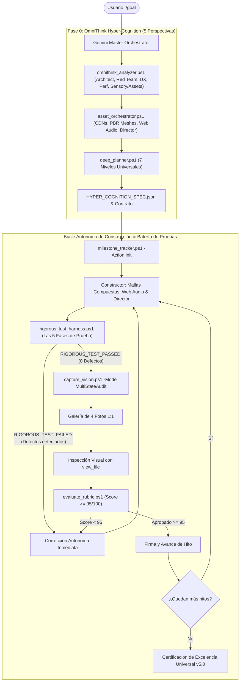

# ⚡ UltraGoal Universal Engine v5.0
### OmniThink System 2 Hyper-Cognition • Asset & Sensory Orchestrator • Procedural Web Audio • Cinematic Director • 5-Phase Rigorous Test Harness

Cuando el usuario invoca `/goal <objetivo>`, se activa **UltraGoal Universal v5.0**. Esta versión incorpora la máxima exigencia de razonamiento autónomo y producción multimedia: **obliga a la IA a pensar en todo pero absolutamente todo antes de programar, obtener recursos visuales/sonoros de alta fidelidad, erradicar modelos 3D primitivos y ejecutar una batería de pruebas de 5 fases sumamente rigurosa**.

---

## 🧠 FASE 0: OMNITHINK HYPER-COGNITION (5 PERSPECTIVAS CRÍTICAS)

> 🛑 **PROHIBICIÓN ABSOLUTA DE PROGRAMACIÓN IMPULSIVA:**
> Queda **TERMINANTEMENTE PROHIBIDO** saltar a programar sin haber ejecutado primero el motor de hiper-cognición:
> ```powershell
> powershell -ExecutionPolicy Bypass -File scripts/omnithink_analyzer.ps1 -GoalObjective "<Objetivo del Usuario>" -OutputPath "HYPER_COGNITION_SPEC.json"
> ```
> 
> El Orquestador analiza la meta de forma obligatoria desde **5 Perspectivas Críticas**:
> 1. **Arquitecto de Sistemas:** Define máquinas de estados finitos (Init, Loading, Ready, Active, Paused, Error), separación estricta de la vista y contratos de datos inmutables.
> 2. **Red Team Adversarial:** ¿Dónde fallará si tomamos atajos? Anticipa scripts rotos sin `type="module"`, pantallazos negros (BSOD), caídas por 404 de assets, teclas pegadas en `window.blur` y fugas de memoria.
> 3. **Especialista en Ergonomía Visual & Cinética:** Exige limitación de cabeceo de cámara en primera persona (-1.5 a 1.5 rad), avance horizontal neutralizado (`dir.y = 0`), física escalada con `DeltaTime` y texturas vóxel nítidas con `NearestFilter`.
> 4. **Perfilador de Rendimiento:** Fija un presupuesto de 60 FPS estables sin pausas de GC, CERO allocations en bucles `animate()` y tiempos de respuesta < 100ms.
> 5. **Arquitecto Sensorial & Orquestador de Assets:** Veto total a primitivas geométricas desnudas solitarias (un cilindro o caja simple). Exige modelos compuestos detallados (múltiples etapas, toberas, RCS, cápsula, aletas) con materiales PBR (`metalness` y `roughness`), diseño sonoro procedural (Web Audio API) y transiciones cinemáticas suaves (`lerp`/`slerp`).

---

## 🚀 APROVISIONAMIENTO DE ASSETS Y SENSORIALIDAD (`asset_orchestrator.ps1`)

Para proyectos 3D, simulaciones, juegos o animaciones, el agente **DEBE consultar el orquestador de assets**:
```powershell
powershell -ExecutionPolicy Bypass -File scripts/asset_orchestrator.ps1 -Domain "Space_Rocket"
```

El orquestador proporciona:
1. **Catálogo de Texturas y Modelos Verificados:** Enlaces oficiales a texturas planetarias de la NASA (Tierra día/noche, nubes, Luna 4K, cielo estrellado) y CDNs de Three.js / GLTF.
2. **Generador de Mallas Compuestas Procedurales:** Plantilla `createHighFidelityMultiStageRocket` con etapas desacoplables, toberas de motor con fulgor térmico emisivo, aletas de estabilización y cápsula dorada.
3. **Motor de Audio Procedural (`ProceduralAudioEngine` / Web Audio API):** Generación de rugido de cohete con pink noise y filtro biquad pasabajos, cuenta regresiva con quindar tones, desacople de etapas y propulsores RCS, sin depender de archivos de audio externos propensos a errores 404.
4. **Director de Vuelo Cinematográfico (`CinematicFlightDirector`):** Control multicámara (plataforma de despegue, cámara de propulsor Booster Cam, seguimiento orbital y cabina) con interpolación suave (`lerp`) que elimina tirones y saltos bruscos.
5. **Directiva de Búsqueda Web (`search_web` / `read_url_content`):** Si el proyecto requiere recursos específicos del mundo real (texturas, mapas, modelos, documentación o esquemas), la IA debe buscar y extraer información verídica antes de construir maquetas simplificadas.

---

## 🧪 LA BATERÍA DE PRUEBAS RIGUROSA DE 5 FASES (`rigorous_test_harness.ps1`)

Antes de entregar cualquier hito o meta final, el agente **DEBE ejecutar obligatoriamente**:
```powershell
powershell -ExecutionPolicy Bypass -File scripts/rigorous_test_harness.ps1 -TargetDirectory "<Ruta_del_Proyecto>"
```

El arnés somete al proyecto a **5 Fases Inquebrantables de Prueba**:

| Fase de Prueba | Qué Audita Empíricamente | Criterio de Rechazo Inmediato |
| :--- | :--- | :--- |
| **Fase 1: Estático & AST** | Sintaxis, compatibilidad ES modules y ausencia total de stubs | Declaraciones `import` sin `type="module"`, TODOs, FIXMEs o catch vacíos. |
| **Fase 2: Arranque en Vivo** | Ejecución real en Chrome Headless (`verify_runtime_boot.ps1`) | Si la app no arranca, crashea o genera errores de consola. |
| **Fase 3: Escrutinio Visual** | Varianza de luminancia de píxeles y filtrado de texturas | Desviación estándar < 3.0 (pantallazo negro/blanco) o texturas vóxel sin `NearestFilter`. |
| **Fase 4: Estabilidad Cinética & Sensorial** | Cámara, física DeltaTime, audio procedural y mallas compuestas | Volteos de cámara en primera persona, simulaciones espaciales/vuelo mudas o mallas reducidas a un cilindro desnudo. |
| **Fase 5: Pruebas Automatizadas** | Ejecución de suite de tests con aserciones formales | Exit code distinto de 0 o menos de 3 aserciones verificadas. |

> 🛑 **Veto Inapelable:** Si cualquiera de las 5 fases reporta un fallo, el veredicto es **`RIGOROUS_TEST_FAILED`** y el proyecto queda bloqueado. El Constructor debe resolver el defecto internamente sin molestar al usuario.

---

## 👁️ PROTOCOLO DE HIPER-ESTRICTEZ VISUAL V-HEX7 (PROHIBIDO APROBAR A LA LIGERA)

> 🛑 **MANDATO DE HIPER-ESTRICTEZ ADVERSARIAL (PROHIBIDO ENTREGAR A CIEGAS):**
> La complacencia visual está terminantemente prohibida. La IA cuenta con capacidades de visión multimodal de última generación. Queda **ESTRICTAMENTE PROHIBIDO** entregar o declarar completado cualquier proyecto con interfaz visual, canvas 3D, juego, simulación, animación o dashboard sin haber inspeccionado visualmente el renderizado real con sus propios ojos a través de `view_file` bajo el **Protocolo V-HEX7**.
>
> ⚠️ **El Arnés (`rigorous_test_harness.ps1` Fase 3) vetará y reprobará automáticamente el proyecto si:**
> - El reporte visual carece de análisis técnico en al menos 4 de los 7 vectores V-HEX7.
> - No cita cuadrantes espaciales de la cuadrícula taxonómica (`[A1]`..`[C3]`).
> - Contiene frases complacientes ("todo se ve bien", "funciona correctamente", "se ve bien") sin justificación técnica.
> - La escena presenta pantalla muerta, monocromo plano (>92% del mismo color) o iluminación plana unlit (<15 niveles dinámicos).
> - La puntuación final otorgada es inferior a **90/100**.

### Los 4 Pasos Obligatorios de Visión Hiper-Estricta:
1. **Paso 1 (Captura Automática y Métricas Cuantitativas):** Ejecutar `capture_vision.ps1 -TargetDirectory "<Ruta_del_Proyecto>"`. El motor renderiza en Chrome Headless a 1280x720, calcula varianza de luminancia, entropía cromática, densidad de gradientes de bordes y genera la galería de 4 sectores:
   - `1_overview_grid`: Fotograma completo con cuadrícula taxonómica `[A1]`..`[C3]`.
   - `2_sector_center`: Recorte 1:1 nativo del foco central (mira, cohete, avatar o bloque principal).
   - `3_sector_ground`: Recorte 1:1 del apoyo en suelo (física Y=0, sombras y colisiones).
   - `4_sector_hud`: Recorte 1:1 del HUD/inventario (hotbars, barras de estado y contadores).
2. **Paso 2 (Invocación Innegociable de `view_file`):** La IA **DEBE LLAMAR OBLIGATORIAMENTE A LA HERRAMIENTA `view_file`** con la ruta absoluta de `1_overview_grid` y `2_sector_center` (o `boot_rendered_screenshot.png`).
3. **Paso 3 (Escrutinio Adversarial bajo los 7 Vectores V-HEX7):**
   - **V1 - Geometría y Jerarquía de Malla:** ¿Es una primitiva básica simple (cubo o cilindro plano) o un modelo jerárquico compuesto de alta fidelidad? Detalla componentes visibles (toque de toberas, aletas, alerones, articulaciones, biseles).
   - **V2 - Materiales, Shaders e Iluminación PBR:** ¿Hay fuentes de luz direccionales, brillos especulares, gradientes de luz y sombras proyectadas, o se aprecia un sombreado plano (MeshBasicMaterial/unlit)?
   - **V3 - Nitidez de Texturas y Filtrado:** ¿Las texturas son nítidas (NearestFilter en voxel, mapas de normales/albedo en modelos realistas)? ¿Hay texturas borrosas, UVs deformadas o texturas magenta faltantes (`#ff00ff`)?
   - **V4 - Integración con Suelo (Y=0) y Sombras de Contacto:** ¿El avatar, vehículo o bloques se apoyan con precisión sobre el plano Y=0 o flotan en el aire / se clipean contra el suelo? ¿Se proyecta sombra de contacto (ambient occlusion)?
   - **V5 - Composición de Fondo y Skybox:** ¿El fondo es un color plano estático o cuenta con skybox, domo celeste, estrellas, niebla volumétrica o gradiente atmosférico?
   - **V6 - HUD, Tipografía y Legibilidad:** ¿El texto de la interfaz y contadores tienen suficiente contraste y nitidez frente al fondo dinámico? ¿Los iconos de hotbar/inventario están alineados y definidos?
   - **V7 - Efectos Visuales Dinámicos y Partículas (VFX):** ¿Existen partículas dinámicas (humo, fuego de propulsión, chispas, polvo o estelas) o la escena carece de dinamismo visual?
4. **Paso 4 (Documentación Rigurosa en `VISUAL_INSPECTION_REPORT.md`):** Redactar `<Ruta_del_Proyecto>\VISUAL_INSPECTION_REPORT.md` basándose en la plantilla oficial `templates/STRICT_VISUAL_INSPECTION_TEMPLATE.md`. Debe incluir citas a cuadrantes taxonómicos (`[A1]`..`[C3]`), análisis técnico profundo (mínimo 100 palabras) y la declaración obligatoria:
   ```text
   Puntuación de Fidelidad Visual: 95/100
   ```

---

## 🏛️ ARQUITECTURA DE LA TRÍADA MULTI-AGENTE v5.0



---

## 📜 RÚBRICA INQUEBRANTABLE (100 PUNTOS, CORTE >= 95)

1. **Domain_Depth_Extensibility (15 pts):** Cero maquetas de juguete. Mínimo 8-15 variantes de datos reales.
2. **Presentation_Shell_UX (15 pts):** Shell estructurado, navegación completa, configuración accesible y botón/handshake de audio.
3. **Kinetic_Asset_Integrity (15 pts):** Pitch clamp, `dir.y = 0`, `DeltaTime`, `NearestFilter`, modelos 3D compuestos PBR, audio procedural activo y director con transiciones suaves.
4. **Performance_Resource_Hygiene (15 pts):** Cero instanciaciones en bucles de renderizado, 60 FPS estables.
5. **Robustness_Error_Handling (15 pts):** Cero catch vacíos, error boundaries activos y validación estricta de entradas.
6. **Functional_Completeness (10 pts):** Cero TODOs/FIXMEs, cero stubs incompletos.
7. **Automated_Testing (15 pts):** Batería de pruebas automatizadas con aserciones rigurosas.