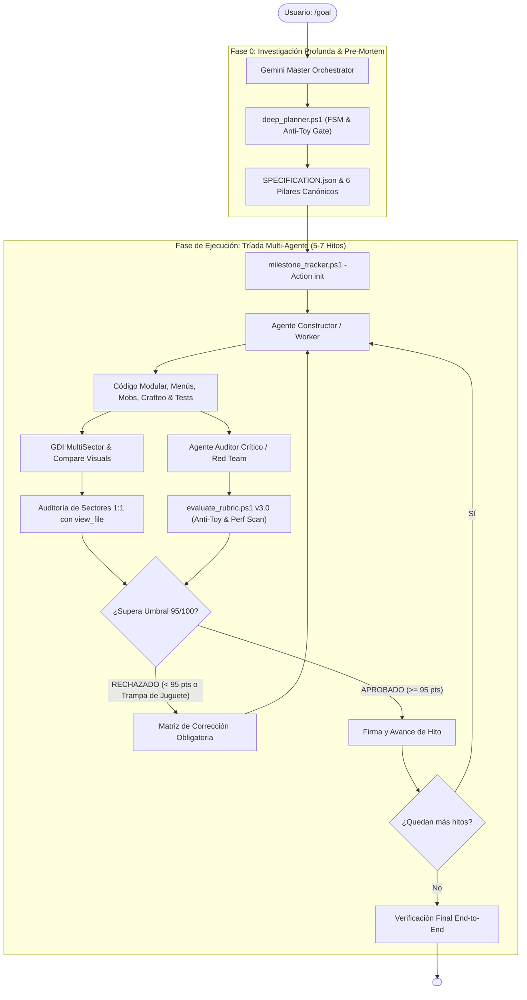

---
name: goal
description: "Motor Autónomo Perfeccionista v3.0 (UltraGoal Engine - Deep Exhaustive Architecture). Ejecuta metas complejas mediante Investigación Profunda (deep_planner), Mapeo de Superficie de Dominio (FSM), Barrera Anti-Juguete (Anti-Toy Pre-Mortem Gate), Tríada Multi-Agente, Escrutinio Visual Adversarial (AVS 1:1) y Rúbrica Inquebrantable >= 95/100."
author: BryanGM12 & Antigravity Autonomous Systems
version: 3.0.0
metadata:
  category: orchestration
  skills: ["goal", "deep-planning", "domain-expansion", "anti-toy-gate", "multi-agent", "adversarial-vision", "quality-gate"]
---

# 🚀 UltraGoal: The Relentless Multi-Agent Perfectionist Engine (v3.0)

Cuando el usuario invoca `/goal <objetivo>`, se activa el **Arnés Autónomo UltraGoal v3.0**. Este sistema erradica de raíz el mayor fallo de los agentes de IA: el **Síndrome de la Demo de Juguete (Toy Demo Syndrome)**, donde una petición ambiciosa (como "haz un clon de Minecraft tal cual" o "un e-commerce completo") se reduce ingenuamente a una maqueta superficial sin menús reales, sin entidades vivas, con solo 2 bloques y con mecánicas rotas.

---

## 🔬 FASE 0: INVESTIGACIÓN PROFUNDA & MAPEO DE DOMINIO CANÓNICO (FSM)

> 🛑 **PROHIBICIÓN ABSOLUTA DE PLANIFICACIÓN SUPERFICIAL:**
> Ante cualquier objetivo, está **ESTRICTAMENTE PROHIBIDO** saltar a programar con un plan improvisado de 3 hitos básicos ("Setup, Código, Fin"). El Orquestador DEBE ejecutar primero la descomposición de alcance exhaustiva:

### 1. Descomposición con `deep_planner.ps1`
Antes de inicializar hitos, ejecuta:
```powershell
powershell -ExecutionPolicy Bypass -File scripts/deep_planner.ps1 -GoalObjective "<Objetivo del Usuario>" -OutputPath "SPECIFICATION.json"
```
Este motor clasifica el dominio y genera el desglose de los **6 Pilares Canónicos de Ingeniería**:
1. **Pilar 1 (Shell, Menús & Audio):** Menú de inicio con título y fondo panorámico/animado, menú de pausa (ESC), pantalla de opciones funcionales (volumen, FOV, render distance) y efectos de sonido. *(Prohibido un mero cartel de 'click para continuar')*.
2. **Pilar 2 (Perspectiva & Controles Fluidos):** Soporte indispensable para Primera Persona Y Tercera Persona (conmutador con tecla F5), mira con wireframe delimitador y física sólida AABB.
3. **Pilar 3 (Entidades Vivas & Sistema de IA):** Al menos 2 tipos de animales pasivos (vaca/cerdo/oveja) y 1 criatura hostil con máquina de estados (Wander, Idle, Chase, Attack). *(Prohibido mundos muertos sin vida)*.
4. **Pilar 4 (Riqueza de Materiales - Zero-Paucity):** Catálogo de mínimo 8 a 12 tipos de bloques/materiales con texturas diferenciadas por cara (pasto, tierra, piedra, madera, hojas, agua, cristal).
5. **Pilar 5 (Mecánicas & Crafteo Matricial):** Cuadrícula de crafteo real (2x2 en inventario + 3x3 en Mesa de Trabajo), diccionario de recetas extensible, inventario con drag-and-drop verificado y apilamiento (x64).
6. **Pilar 6 (Ciclo Ambiental & Persistencia):** Ciclo día/noche (sol y luna), partículas al romper bloques y guardado/carga del mundo (LocalStorage/JSON).

### 2. El Análisis Pre-Mortem Anti-Juguete
El Agente Orquestador debe plantearse la pregunta destructiva:
*"¿De qué 5 maneras este proyecto podría parecer una maqueta de juguete mediocre?"*
Las 5 trampas identificadas se convierten automáticamente en **Cláusulas de Defensa No Negociables** dentro del contrato de hitos.

---

## 👁️ ESCRUTINIO VISUAL ADVERSARIAL (AVS 1:1) & HEATMAP DIFERENCIAL

Para garantizar que el mundo y la interfaz funcionen a nivel microscópico:
1. **Recortes Multi-Sector 1:1 (`scripts/capture_vision.ps1 -Mode MultiSector`):**
   - **`sector_ground.png` (Sector C2):** El auditor inspecciona si los bloques tocan el suelo real (Y=0). Si los bloques no se ven en el suelo o flotan: **VETO INMEDIATO**.
   - **`sector_hud.png` (Sector C3):** Verifica números de ítems (x64) y marco de selección activa.
   - **`sector_center.png` (Sector B2):** Verifica la mira y el raycast wireframe.
2. **Auditoría de Arrastre Dinámico (`scripts/compare_visuals.ps1`):**
   - Compara el fotograma previo vs posterior a arrastrar un ítem en el inventario. Si el mapa diferencial no detecta desplazamiento acompañando al cursor: **VETO INMEDIATO**.

---

## ⚡ BARRERA DE RENDIMIENTO & ANTI-STUTTER

El escáner de código [evaluate_rubric.ps1](file:///C:/Users/Administrator/.gemini/config/skills/goal/scripts/evaluate_rubric.ps1) audita:
- Prohibición de `new THREE.Vector3()` o matrices en bucles `animate()` / `requestAnimationFrame()` (Cero GC pauses).
- Obligatoriedad de `InstancedMesh` o combinación de geometrías de chunks en terrenos vóxel.

---

## 🏛️ ARQUITECTURA DE LA TRÍADA MULTI-AGENTE v3.0



---

## 📋 PROTOCOLO DE TRABAJO OBLIGATORIO

1. **Paso 1: Investigación Profunda:**
   - Ejecuta `deep_planner.ps1` con el objetivo del usuario.
   - Crea el artefacto `implementation_plan.md` reflejando los 6 Pilares Canónicos y el Pre-Mortem.
   - Inicializa el estado con los 6 o 7 hitos sugeridos:
     ```powershell
     powershell -ExecutionPolicy Bypass -File scripts/milestone_tracker.ps1 -Action init -GoalTitle "<Título>" -Milestones "<Hitos_del_deep_planner>"
     ```
2. **Paso 2: Ciclo Constructor -> Auditor -> Visión por cada hito:**
   - Constructor programa menús, cámaras, entidades y recetas reales sin código falso.
   - Auditor ejecuta `evaluate_rubric.ps1 -TargetPath <dir> -Category <Cat>` (si falta menú, mobs o crafteo, la rúbrica veta la entrega).
   - Visión ejecuta `capture_vision.ps1 -Mode MultiSector` e inspecciona los recortes 1:1.
3. **Paso 3: Cierre:**
   - Solo cuando todos los hitos estén aprobados con excelencia (>= 95/100) y cero defectos visuales, se emite `<!-- GOAL_COMPLETE -->`.