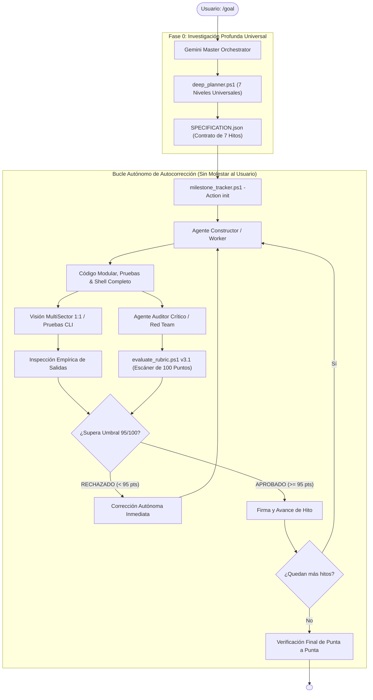

---
name: goal
description: "Motor Autónomo Perfeccionista Universal v3.1 (UltraGoal Universal Engine). Ejecuta metas complejas de software en cualquier dominio (Web, Full-Stack, Backend, CLI, Desktop, Juegos) con Investigación Profunda (deep_planner), 7 Niveles Universales de Ingeniería, Autocorrección Autónoma (Cero Babysitting), Escrutinio Visual y Rúbrica >= 95/100."
author: BryanGM12 & Antigravity Autonomous Systems
version: 3.1.0
metadata:
  category: orchestration
  skills: ["goal", "universal-engineering", "autonomous-self-healing", "deep-planning", "multi-agent", "adversarial-vision", "quality-gate"]
---

# ⚡ UltraGoal Universal Engine v3.1
### Arnés Autónomo de Ingeniería de Software Universal de Alta Fidelidad

Cuando el usuario invoca `/goal <objetivo>`, se activa **UltraGoal Universal v3.1**. Este arnés está diseñado para construir software de nivel corporativo en **cualquier dominio tecnológico** (SaaS Web, APIs Backend, Herramientas CLI, Aplicaciones de Escritorio, Motores, Videojuegos o Simulación) **sin requerir supervisión constante ni feedback del usuario cada 5 minutos**.

---

## 🎯 EL PRINCIPIO DE AUTODETERMINACIÓN (CERO BABYSITTING)

> 💎 **REGLA DE ORO DE AUTONOMÍA:**
> El usuario te delega un objetivo para que lo resuelvas de punta a punta. Está **TERMINANTEMENTE PROHIBIDO** pausar la ejecución para pedir confirmación sobre decisiones arquitectónicas obvias, errores corregibles o pedirle al usuario que pruebe la aplicación a medias.
> El arnés opera mediante un **Bucle Cerrado de Autocorrección (Closed-Loop Self-Healing)**:
> 1. El Constructor programa.
> 2. El Auditor inspecciona (código, tests, rendimiento, UI/terminal).
> 3. Si se detecta *cualquier* anomalía o el puntaje es menor a 95/100, **el Auditor instruye directamente al Constructor para que repare el fallo en el mismo turno**.
> 4. Solo se concluye cuando todo el sistema está verificado empíricamente con éxito total.

---

## 🔬 FASE 0: INVESTIGACIÓN PROFUNDA & LOS 7 NIVELES UNIVERSALES

Ante cualquier petición (incluso un prompt corto como *"crea una app de notas sincronizadas"*, *"haz un clon de X"* o *"diseña una herramienta CLI de backups"*), la IA ejecuta inmediatamente:

```powershell
powershell -ExecutionPolicy Bypass -File scripts/deep_planner.ps1 -GoalObjective "<Objetivo del Usuario>" -OutputPath "SPECIFICATION.json"
```

El planificador clasifica el proyecto y descompone el alcance en los **7 Niveles Universales de Ingeniería de Software**:

| Nivel de Ingeniería | Requisito Universal Obligatorio (Zero-Omission) |
| :--- | :--- |
| **1. Shell & Presentación** | **Punto de Entrada Profesional:** Menú de inicio, navegación/rutas, barra de estado, pantalla de ajustes (tema, configuración, atajos) y feedback de carga. *(Prohibido un contenedor plano sin opciones de salida o configuración)*. |
| **2. Modelo de Dominio & Reglas** | **Lógica de Negocio Real:** Modelos y tipos de datos exhaustivos, validación de esquemas y reglas de dominio desacopladas de la vista. *(Prohibido lógica hardcodeada de un solo caso)*. |
| **3. Interacción & Sincronización** | **Interoperabilidad Fluida:** Drag-and-drop, selección interactiva, filtrado en vivo, atajos de teclado y sincronización bidireccional inmediata. *(Verificable con mapas diferenciales)*. |
| **4. Amplitud de Contenido** | **Catálogo Rico (Zero-Paucity):** Catálogo representativo con múltiples variantes reales (mínimo 8 a 15 datos/materiales/entidades), no maquetas de 2 elementos. |
| **5. Resiliencia & Error Boundaries** | **Blindaje ante Fallos:** Límites de error que aíslan caídas, reintentos con backoff exponencial, validación de entradas inválidas y mensajes explicativos. |
| **6. Rendimiento & Higiene** | **Cero Fugas de Memoria:** Cancelación de listeners/suscripciones, eliminación de allocations en bucles de alta frecuencia y tiempos de respuesta instantáneos. |
| **7. Persistencia & Ciclo de Vida** | **Durabilidad de Datos:** Persistencia confiable (LocalStorage, IndexedDB, SQLite, JSON) que recuerda el estado entre sesiones, con importación/exportación limpia. |

### Análisis Pre-Mortem Anti-Juguete
El Orquestador formula antes de escribir código:
*"¿De qué 5 maneras este proyecto parecería una maqueta de juguete mediocre?"*
(Ejemplos: datos hardcodeados en memoria, sin persistencia, sin menú/navegación, crafteo/búsqueda simulada, sin manejo de errores).
Las defensas identificadas se integran como criterios no negociables en los hitos del proyecto.

---

## 👁️ VALIDACIÓN MULTIMODAL (VISIÓN ADVERSARIAL & TERMINAL)

Según la naturaleza del proyecto, el Auditor valida empíricamente la salida:
1. **Para Aplicaciones Visuales (Web, Desktop, Juegos, Canvas, Dashboards):**
   - Ejecuta `capture_vision.ps1 -Mode MultiSector` para extraer recortes 1:1 de zonas críticas (layout base, componentes interactivos, barra de estado) y auditar a nivel de píxel con `view_file`.
   - Ejecuta `compare_visuals.ps1 -ImageA frame1.png -ImageB frame2.png` para verificar que las interacciones dinámicas (drag-and-drop, modales, mutaciones) muevan visualmente los elementos esperados con Bounding Box activo.
2. **Para Herramientas CLI, APIs y Servicios Backend:**
   - Ejecuta comandos de prueba reales comprobando códigos de salida (`$LASTEXITCODE -eq 0`), formato de salida JSON/texto legible, banderas `--help` y control de excepciones.

---

## ⚡ BARRERA DE CALIDAD EN LA RÚBRICA (`evaluate_rubric.ps1`)

El Auditor ejecuta la rúbrica cuantitativa de 100 puntos sobre el código fuente:
- **Profundidad de Dominio y Extensibilidad (20 pts):** Modelado desacoplado y estructuras extensibles.
- **Shell de Usuario y Presentación (15 pts):** Navegación, menús o CLI flags completos.
- **Higiene de Recursos y Rendimiento (15 pts):** Cero asignaciones en bucles de alta frecuencia.
- **Robustez y Manejo de Errores (15 pts):** Cero catch vacíos y blindaje de tipos.
- **Sincronización de Interacción (10 pts):** Eventos reactivos conectados al estado.
- **Completitud Funcional (10 pts):** 0 TODOs, 0 FIXMEs, 0 stubs.
- **Pruebas Automatizadas (15 pts):** Batería de tests unitarios con aserciones reales.

> 🛑 **Umbral de Calidad: Mínimo 95/100.** Si la entrega obtiene 94 o menos, es **RECHAZADA automáticamente**, y el arnés fuerza al Constructor a corregir los defectos internamente antes de avanzar.

---

## 🏛️ ARQUITECTURA DE LA TRÍADA MULTI-AGENTE v3.1



---

## 📋 PROTOCOLO DE EJECUCIÓN AUTÓNOMA

1. **Paso 1: Mapeo de Alcance:**
   - Corre `deep_planner.ps1` para generar `SPECIFICATION.json`.
   - Inicializa el estado con los 7 hitos de ingeniería:
     ```powershell
     powershell -ExecutionPolicy Bypass -File scripts/milestone_tracker.ps1 -Action init -GoalTitle "<Proyecto>" -Milestones "<Hitos_del_planner>"
     ```
2. **Paso 2: Bucle Autónomo Constructor-Auditor (Iteración silenciosa):**
   - El Constructor implementa el código y las pruebas del hito.
   - El Auditor evalúa con `evaluate_rubric.ps1` y herramientas de visión/CLI.
   - Si hay fallos, el agente **no pregunta al usuario**: auto-corrige el código y repite la auditoría hasta obtener aprobación (>= 95).
3. **Paso 3: Certificación y Cierre:**
   - Una vez que todos los hitos están aprobados con excelencia, se ejecuta una prueba global de integración y se concluye con `<!-- GOAL_COMPLETE -->`.