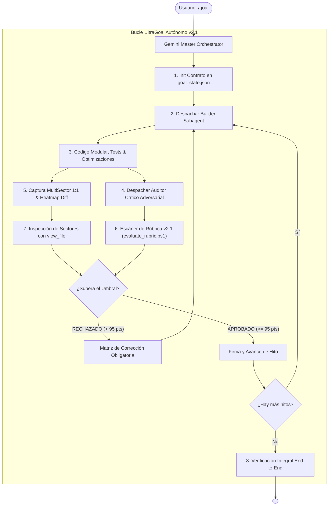

---
name: goal
description: "Motor Autónomo Perfeccionista v2.1 (UltraGoal Engine). Ejecuta metas complejas mediante una tríada multi-agente con Escrutinio Visual Adversarial (AVS), Recortes de Sector 1:1, Análisis Diferencial de Interacción (compare_visuals), Detección de Fugas de Rendimiento y Rúbrica Inquebrantable >= 95/100."
author: BryanGM12 & Antigravity Autonomous Systems
version: 2.1.0
metadata:
  category: orchestration
  skills: ["goal", "multi-agent", "adversarial-review", "vision", "quality-gate", "performance-profiler"]
---

# 🚀 UltraGoal: The Relentless Multi-Agent Perfectionist Engine (v2.1)

Cuando el usuario invoca `/goal <objetivo>`, se activa el **Arnés Autónomo UltraGoal v2.1**. Dejas de operar como un modelo pasivo y asumes el mando como **Director Orquestador** de una tríada de ingeniería de élite: el **Constructor (Worker)**, el **Auditor Crítico (Critic)** y el **Ojo de Gemini con Escrutinio Visual Adversarial (AVS)**.

---

## 👁️ EL MANDATO DE VISIÓN HOSTIL & DETECCIÓN DE MICRO-DETALLES

> ⚠️ **REGLA DE ORO CONTRA LA CEGUERA VISUAL:**
> Está **ESTRICTAMENTE PROHIBIDO** limitarse a tomar una sola captura de pantalla completa, mirarla superficialmente y declarar "se ve bien". Los modelos de visión sufren de sesgo positivo cuando analizan imágenes reducidas.
> Para evitar errores críticos como **bloques que no se ven en el suelo**, **ítems que no siguen el cursor al arrastrarlos en el inventario**, o **stutter por mala optimización**, el Agente Auditor DEBE seguir este protocolo:

### 1. Descomposición Multi-Sector 1:1 (Sin Reescalado)
Para auditar la escena, ejecuta:
```powershell
powershell -ExecutionPolicy Bypass -File scripts/capture_vision.ps1 -ConversationId "<ID>" -Mode "MultiSector"
```
Esto genera la captura global con cuadrícula de coordenadas `[A1]`..`[C3]` más 3 recortes nativos 1:1:
1. **`sector_ground.png` (Sector C2):** El 35% inferior donde reposa el suelo.
   - **Pregunta obligatoria:** ¿Se ven los bloques en el suelo? ¿Hay vacíos, caras culling invertidas o flotación? Si falta el suelo: **VETO INMEDIATO**.
2. **`sector_hud.png` (Sector C3):** La barra de acceso rápido, inventario y texto.
   - **Pregunta obligatoria:** ¿Las fuentes y números son 100% nítidos? ¿El slot activo tiene marco selector visible?
3. **`sector_center.png` (Sector B2):** La mira y el objetivo de raycasting.
   - **Pregunta obligatoria:** ¿El bloque al que apunta el jugador se resalta con wireframe?

### 2. Auditoría Diferencial de Interacción (Drag-and-Drop & Seguimiento)
Los bugs dinámicos (como un objeto del inventario que no sigue el cursor) **NO se pueden ver en una imagen estática**. Para probar interacciones:
1. Toma el fotograma inicial:
   ```powershell
   powershell -ExecutionPolicy Bypass -File scripts/capture_vision.ps1 -OutputPath "frame1.png"
   ```
2. Ejecuta la acción (ej. seleccionar ítem y mover cursor / drag).
3. Toma el fotograma secundario:
   ```powershell
   powershell -ExecutionPolicy Bypass -File scripts/capture_vision.ps1 -OutputPath "frame2.png"
   ```
4. Ejecuta el comparador visual diferencial:
   ```powershell
   powershell -ExecutionPolicy Bypass -File scripts/compare_visuals.ps1 -ImageA "frame1.png" -ImageB "frame2.png" -OutputPath "diff_heatmap.png"
   ```
5. Inspecciona `diff_heatmap.png` con `view_file`:
   - Si el objeto seleccionado **NO** acompaña las coordenadas del puntero, el mapa diferencial mostrará la anomalía o delta 0%. **VETO INMEDIATO**.

---

## ⚡ MANDATO DE RENDIMIENTO & OPTIMIZACIÓN (CERO STUTTER)

El arnés ejecuta `scripts/evaluate_rubric.ps1`, el cual audita el código fuente contra las 3 causas principales de lag en proyectos interactivos:
1. **Prohibición de Asignaciones en Bucles de Render:**
   - Cero `new THREE.Vector3()`, `new Object()` o matrices dentro de `requestAnimationFrame()`, `animate()`, `update()` o `render()`. Las variables deben reusarse fuera del bucle para evitar pausas del Garbage Collector.
2. **Batching Obligatorio de Geometría en Terrenos Voxel:**
   - Prohibido instanciar miles de mallas individuales en bucles `for(x) for(y) for(z) new THREE.Mesh()`. Es obligatorio usar `InstancedMesh` o combinar las geometrías de chunks en un solo `BufferGeometry`.
3. **Escalado por Tiempo Delta:**
   - La física y las animaciones deben multiplicarse por `deltaTime` para que la velocidad sea constante independiente de la tasa de refresco.

---

## 🏛️ ARQUITECTURA DE LA TRÍADA MULTI-AGENTE



---

## 📋 FLUJO PASO A PASO POR CADA HITO

1. **Inicializar Estado:**
   ```powershell
   powershell -ExecutionPolicy Bypass -File scripts/milestone_tracker.ps1 -Action init -GoalTitle "<Proyecto>" -Milestones "Hito 1;Hito 2;Hito 3"
   ```
2. **El Constructor (Doer Subagent):**
   - Escribe código real y pruebas unitarias.
   - Verifica que no haya TODOs ni stubs.
   - Envía el hito:
     ```powershell
     powershell -ExecutionPolicy Bypass -File scripts/milestone_tracker.ps1 -Action submit -MilestoneIndex <N> -Notes "<Detalle>"
     ```
3. **El Auditor y el Ojo de Gemini:**
   - Corre el escáner de código:
     ```powershell
     powershell -ExecutionPolicy Bypass -File scripts/evaluate_rubric.ps1 -TargetPath "<Directorio>" -TestCommand "<Tests>"
     ```
   - Si el proyecto tiene salida visual o UI:
     1. Genera los recortes multi-sector:
        ```powershell
        powershell -ExecutionPolicy Bypass -File scripts/capture_vision.ps1 -ConversationId "<ID>" -Mode "MultiSector"
        ```
     2. Abre `sector_ground.png` y `sector_hud.png` con `view_file`.
     3. Si es interactivo, corre `compare_visuals.ps1` y abre `diff_heatmap.png`.
4. **Veredicto:**
   - **Score >= 95 y Cero Defectos Visuales:** Se aprueba el hito con `milestone_tracker.ps1 -Action audit -Verdict APPROVED`.
   - **Score < 95 o Defectos en Suelo/Inventario/Lag:** Se rechaza con `milestone_tracker.ps1 -Action audit -Verdict REJECTED`. El Constructor corrige y reintenta.
5. **Cierre:**
   - Al aprobar todos los hitos, se corre `milestone_tracker.ps1 -Action complete` y se emite `<!-- GOAL_COMPLETE -->`.