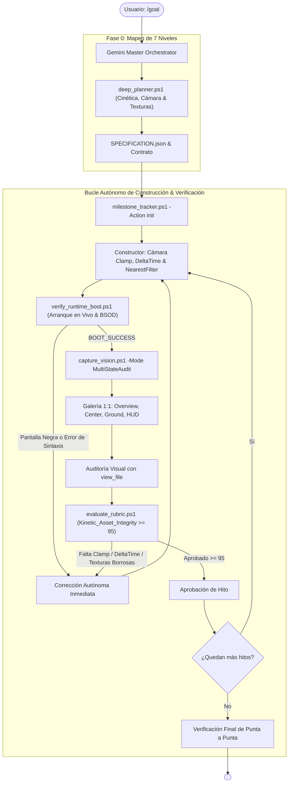

---
name: goal
description: "Motor Autónomo Perfeccionista Universal v3.3 (UltraGoal Engine - Kinetic, Texture & Boot Integrity). Erradica los proyectos que no inician, cámaras rotas que se dan vuelta, movimientos con bugs que vuelan al mirar arriba y texturas borrosas o plásticas. Incorpora Barrera Cinética & Texturas (Kinetic_Asset_Integrity), Verificación de Arranque en Vivo (verify_runtime_boot.ps1), Detección de Pantalla Negra (BSOD Gate), Galería Multi-Foto (MultiStateAudit) y Rúbrica >= 95/100."
author: BryanGM12 & Antigravity Autonomous Systems
version: 3.3.0
metadata:
  category: orchestration
  skills: ["goal", "kinetic-integrity", "texture-filtering", "live-runtime-boot", "dead-screen-gate", "multi-photo-vision", "quality-gate"]
---

# ⚡ UltraGoal Universal Engine v3.3
### Kinetic & Camera Stability • Pixel-Art Texture Integrity • Live Boot & Multi-Photo Scrutiny

Cuando el usuario invoca `/goal <objetivo>`, se activa **UltraGoal Universal v3.3**. Esta versión erradica de forma definitiva los dos fallos más comunes reportados en simulaciones y juegos 3D:
1. **Cámara y Movimiento Rotos:** Cámaras que se dan vuelta boca abajo al mover el ratón, personajes que vuelan al mirar hacia arriba o se hunden al mirar al suelo, y velocidad errática sin `DeltaTime`.
2. **Texturas Horribles / Plásticas:** Bloques de un solo color plano o texturas borrosas tipo smudge causadas por la falta de filtrado `NearestFilter`.

---

## 🕹️ EL INVARIANTE CINÉTICO Y DE TEXTURAS (ZERO-BROKEN-CONTROLS)

> 🛑 **REGLAS NO NEGOCIABLES DE MOVIMIENTO, CÁMARA Y TEXTURAS:**
> En todo proyecto interactivo, el Constructor DEBE cumplir obligatoriamente con los siguientes estándares de ingeniería. La rúbrica [evaluate_rubric.ps1](file:///C:/Users/Administrator/.gemini/config/skills/goal/scripts/evaluate_rubric.ps1) audita y **VETA AUTOMÁTICAMENTE** cualquier código que viole estas reglas:

### 1. Bloqueo de Cabeceo de Cámara (Anti-Flip Clamping)
- **El Bug:** Al mover el ratón hacia arriba o abajo, la cámara sobrepasa los 90° e invierte la vista del mundo de cabeza.
- **La Solución Obligatoria:** Limitar el cabeceo vertical con `Math.max(-1.5, Math.min(1.5, pitch))` o `THREE.MathUtils.clamp(camera.rotation.x, -Math.PI / 2.05, Math.PI / 2.05)`.

### 2. Neutralización del Eje Y en Avance (Anti-Flying Bug)
- **El Bug:** Al presionar W mirando hacia el cielo, el vector de avance apunta hacia arriba y el personaje "vuela" sin control; o al mirar al suelo, se hunde en la tierra.
- **La Solución Obligatoria:** Extraer el vector de vista del jugador, pero **neutralizar el componente Y a cero** antes de normalizar y aplicar velocidad:
  ```javascript
  camera.getWorldDirection(moveDirection);
  moveDirection.y = 0;
  moveDirection.normalize();
  camera.position.addScaledVector(moveDirection, speed * dt);
  ```

### 3. Físicas con DeltaTime (Anti-Framerate Stutter)
- **El Bug:** Desplazamientos fijos (`pos.x += speed`) que hacen que el juego vaya 3 veces más rápido en pantallas de 144Hz que en 60Hz.
- **La Solución Obligatoria:** Integrar siempre el delta de tiempo: `const dt = clock.getDelta();` y escalar cada traslación y salto por `dt`.

### 4. Texturas Vóxel Nítidas (Anti-Blurry Textures)
- **El Bug:** Texturas de 16x16 generadas en canvas o cargadas que se ven como manchas borrosas porque Three.js usa por defecto filtrado bilineal (`LinearFilter`).
- **La Solución Obligatoria:** Forzar filtrado de vecino más cercano en todas las texturas de vóxel:
  ```javascript
  texture.magFilter = THREE.NearestFilter;
  texture.minFilter = THREE.NearestFilter;
  texture.generateMipmaps = false;
  ```
- **Mapeo por Caras Diferenciadas:** Prohibido usar el mismo color para todo el cubo. El césped debe tener cara superior verde con ruido procedural, laterales de tierra con capa de hierba y cara inferior de tierra pura.

---

## 🚫 EL INVARIANTE DE ARRANQUE EN VIVO (ZERO-BROKEN-BOOT)

Queda **TERMINANTEMENTE PROHIBIDO** entregar una meta sin antes verificar que arranque en un entorno real con:
```powershell
powershell -ExecutionPolicy Bypass -File scripts/verify_runtime_boot.ps1 -TargetDirectory "<Ruta_del_Proyecto>"
```
- **Detección de Pantallazo Negro:** Si el 98%+ de la pantalla es negra (`#000000`) o la desviación estándar de luminancia es menor a 3.0, **la entrega queda vetada de inmediato**.
- **Inspección Pre-Vuelo:** Veta scripts con `import` sin `type="module"` y archivos referenciados inexistentes.

---

## 📸 PROTOCOLO DE AUDITORÍA MULTI-FOTO (MULTI-STATE VISUAL SCRUTINY)

El Auditor debe ejecutar:
```powershell
powershell -ExecutionPolicy Bypass -File scripts/capture_vision.ps1 -Mode MultiStateAudit
```
Esto genera una **Galería de 4 Fotos Críticas**:
1. **`1_overview_grid.png`:** Panorama general con cuadrícula de coordenadas `[A1]..[C3]`.
2. **`2_sector_center.png`:** Recorte 1:1 del centro (mira, wireframe del bloque seleccionado y horizonte).
3. **`3_sector_ground.png`:** Recorte 1:1 del suelo para **verificar empíricamente que los bloques toquen el piso Y=0 y que las texturas sean nítidas**.
4. **`4_sector_hud.png`:** Recorte 1:1 del inventario y números de ítems.

El Auditor **DEBE abrir cada imagen con `view_file`** para verificar la calidad visual a nivel microscópico.

---

## 🏛️ ARQUITECTURA DE LA TRÍADA MULTI-AGENTE v3.3



---

## 📋 PROTOCOLO DE EJECUCIÓN OBLIGATORIO

1. **Paso 1: Planificación con Defensas Cinéticas y de Texturas:**
   - Ejecuta `deep_planner.ps1`.
   - Inicializa el estado con `milestone_tracker.ps1 -Action init`.
2. **Paso 2: Construcción Blindada:**
   - El Constructor implementa:
     - Pitch clamp en la cámara ($-1.5$ a $1.5$ rad).
     - Desplazamiento horizontal neutro (`dir.y = 0`).
     - Física escalada con `dt = clock.getDelta()`.
     - Texturas con `NearestFilter` y caras diferenciadas.
     - Etiquetas `<script type="module">`.
3. **Paso 3: Verificación de Arranque en Vivo & Auditoría Multi-Foto:**
   - Ejecuta `verify_runtime_boot.ps1`.
   - Ejecuta `capture_vision.ps1 -Mode MultiStateAudit`.
   - El Auditor inspecciona cada recorte con `view_file`.
   - Ejecuta `evaluate_rubric.ps1 -LiveBootCheck`.
4. **Paso 4: Entrega:**
   - Solo cuando el juego arranca, los controles responden sin volteos de cámara, las texturas son nítidas y la rúbrica alcanza >= 95/100, se emite `<!-- GOAL_COMPLETE -->`.