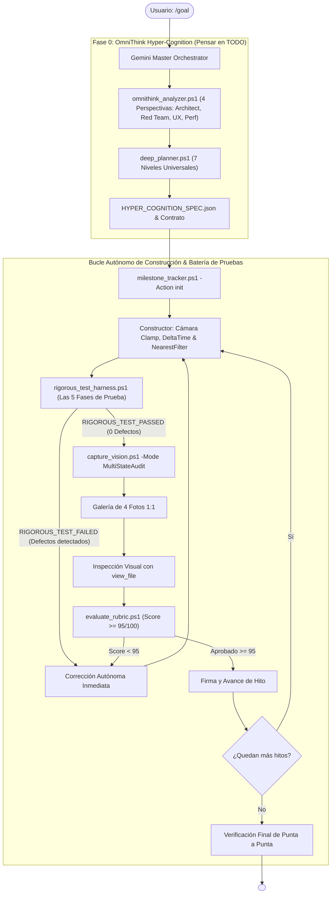

---
name: goal
description: "Motor Autónomo Perfeccionista Universal v4.0 (UltraGoal Engine - OmniThink Hyper-Cognition & 5-Phase Rigorous Test Harness). Obliga a la IA a 'pensar en todo pero absolutamente todo' mediante Razonamiento por Primeros Principios (omnithink_analyzer.ps1), 4 Perspectivas Críticas (Arquitecto, Red Team, Cinética, Rendimiento), Verificación de Arranque en Vivo, Barrera de Pantallazo Negro, Estabilidad de Cámara y Rúbrica >= 95/100."
author: BryanGM12 & Antigravity Autonomous Systems
version: 4.0.0
metadata:
  category: orchestration
  skills: ["goal", "omnithink-hypercognition", "system2-thinking", "rigorous-test-harness", "kinetic-integrity", "live-boot-verifier", "multi-photo-vision", "quality-gate"]
---

# ⚡ UltraGoal Universal Engine v4.0
### OmniThink System 2 Hyper-Cognition • 5-Phase Rigorous Test Harness • Zero-Broken-Delivery

Cuando el usuario invoca `/goal <objetivo>`, se activa **UltraGoal Universal v4.0**. Esta versión incorpora la máxima exigencia de razonamiento autónomo: **obliga a la IA a pensar en todo pero absolutamente todo antes de programar, anticipando cada posible fallo mediante 4 perspectivas analíticas y ejecutando una batería de pruebas de 5 fases sumamente rigurosa**.

---

## 🧠 FASE 0: OMNITHINK HYPER-COGNITION (PENSAR EN TODO POR PRIMEROS PRINCIPIOS)

> 🛑 **PROHIBICIÓN ABSOLUTA DE PROGRAMACIÓN IMPULSIVA:**
> Queda **TERMINANTEMENTE PROHIBIDO** saltar a programar sin haber ejecutado primero el motor de hiper-cognición:
> ```powershell
> powershell -ExecutionPolicy Bypass -File scripts/omnithink_analyzer.ps1 -GoalObjective "<Objetivo del Usuario>" -OutputPath "HYPER_COGNITION_SPEC.json"
> ```
> 
> El Orquestador analiza la meta de forma obligatoria desde **4 Perspectivas Críticas**:
> 1. **Arquitecto de Sistemas:** Define máquinas de estados finitos (Init, Loading, Ready, Active, Paused, Error), separación estricta de la vista y contratos de datos inmutables.
> 2. **Red Team Adversarial:** ¿Dónde fallará si tomamos atajos? Anticipa scripts rotos sin `type="module"`, pantallazos negros (BSOD), caídas por 404 de assets, teclas pegadas en `window.blur` y fugas de memoria.
> 3. **Especialista en Ergonomía Visual & Cinética:** Exige limitación de cabeceo de cámara (-1.5 a 1.5 rad), avance horizontal neutralizado (`dir.y = 0`), física escalada con `DeltaTime`, texturas con `NearestFilter` y mapeo por caras.
> 4. **Perfilador de Rendimiento:** Fija un presupuesto de 60 FPS estables sin pausas de GC, CERO allocations en bucles `animate()` y tiempos de respuesta < 100ms.

---

## 🧪 LA BATERÍA DE PRUEBAS RIGUROSA DE 5 FASES (`rigorous_test_harness.ps1`)

Antes de entregar cualquier hito o meta final, el agente **DEBE ejecutar obligatoriamente**:
```powershell
powershell -ExecutionPolicy Bypass -File scripts/rigorous_test_harness.ps1 -TargetDirectory "<Ruta_del_Proyecto>"
```

El arnés somete al proyecto a **5 Fases Inquebrantables de Prueba**:

| Fase de Prueba | Qué Audita Empíricamente | Criterio de Rechazo Inmediato |
| :--- | :--- | :--- |
| **Fase 1: Estático & AST** | Sintaxis, compatibilidad ES modules y ausencia total de stubs | Declaraciones `import` sin `type="module"`, TODOs, FIXMEs o catch vacíos. |
| **Fase 2: Arranque en Vivo** | Ejecución real en Chrome Headless (`verify_runtime_boot.ps1`) | Si la app no arranca, crashea o genera errores de consola. |
| **Fase 3: Escrutinio Visual** | Varianza de luminancia de píxeles y filtrado de texturas | Desviación estándar < 3.0 (pantallazo negro/blanco) o texturas vóxel sin `NearestFilter`. |
| **Fase 4: Estabilidad Cinética** | Cámara de 360°, vector de avance y escala temporal | Cámara sin pitch clamp (se da vuelta), vector de avance volador o falta de `DeltaTime`. |
| **Fase 5: Pruebas Automatizadas** | Ejecución de suite de tests con aserciones formales | Exit code distinto de 0 o menos de 3 aserciones verificadas. |

> 🛑 **Veto Inapelable:** Si cualquiera de las 5 fases reporta un fallo, el veredicto es **`RIGOROUS_TEST_FAILED`** y el proyecto queda bloqueado. El Constructor debe resolver el defecto internamente sin molestar al usuario.

---

## 📸 PROTOCOLO DE AUDITORÍA MULTI-FOTO CON `view_file`

El Auditor debe ejecutar:
```powershell
powershell -ExecutionPolicy Bypass -File scripts/capture_vision.ps1 -Mode MultiStateAudit
```
Genera la **Galería de 4 Fotos Críticas**:
1. **`1_overview_grid.png`:** Panorama general con cuadrícula `[A1]..[C3]`.
2. **`2_sector_center.png`:** Recorte 1:1 del centro (mira, wireframe del bloque seleccionado y horizonte).
3. **`3_sector_ground.png`:** Recorte 1:1 del suelo (para verificar que los bloques toquen el piso Y=0 y que las texturas sean nítidas).
4. **`4_sector_hud.png`:** Recorte 1:1 del inventario y números de ítems.

El Auditor **DEBE examinar cada imagen con la herramienta `view_file`** para certificar la excelencia visual.

---

## 🏛️ ARQUITECTURA DE LA TRÍADA MULTI-AGENTE v4.0



---

## 📋 PROTOCOLO DE EJECUCIÓN AUTÓNOMA

1. **Paso 1: OmniThink (Hiper-Cognición):**
   - Corre `omnithink_analyzer.ps1` y `deep_planner.ps1`.
   - Inicializa el estado con `milestone_tracker.ps1 -Action init`.
2. **Paso 2: Construcción Defensiva:**
   - El Constructor implementa resolviendo los vectores de fallo identificados por el Red Team.
3. **Paso 3: Batería Rigurosa de 5 Fases & Multi-Foto:**
   - Corre `rigorous_test_harness.ps1`. Si falla cualquier fase, auto-repara en el mismo ciclo.
   - Corre `capture_vision.ps1 -Mode MultiStateAudit` e inspecciona con `view_file`.
   - Corre `evaluate_rubric.ps1 -LiveBootCheck`.
4. **Paso 4: Certificación:**
   - Solo cuando el arnés de 5 fases obtiene `RIGOROUS_TEST_PASSED` y la rúbrica alcanza >= 95/100, se emite `<!-- GOAL_COMPLETE -->`.